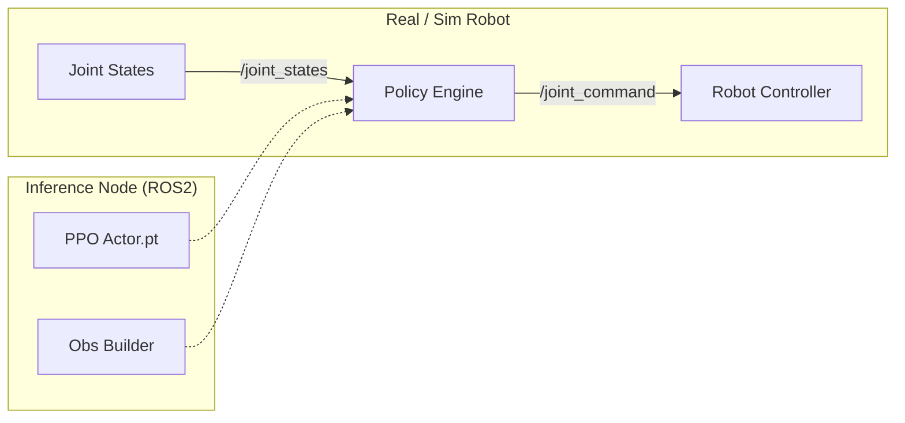

# Digital Twin & Physical AI Engineering Portfolio

**Author**: Physical AI Engineer  
**Focus**: Digital Twin, Robotics Simulation, Reinforcement Learning, Foundation Models  

---

## 🚀 Executive Summary

본 포트폴리오는 **NVIDIA Omniverse** 및 **Isaac Ecosystem**을 기반으로 한 **Physical AI** 구현 프로젝트를 다룹니다.
단순한 시뮬레이션을 넘어, **Reinforcement Learning(RL) 기반의 정밀 로봇 제어**, **Sim-to-Real 배포 파이프라인**, 그리고 **멀티모달 데이터 전처리 시스템**까지의 엔지니어링 역량을 입증합니다.

---

## 🛠️ Core Project 1: Precision Robotics with RL (Isaac Lab)

### **Project: Suction Gripper Alignment utilizing RL**

**Challenge**  
물류 현장의 비정형 박스 픽킹 시, 단순 IK(Inverse Kinematics) 기반 제어는 박스 표면의 기울기나 위치 불확실성으로 인해 흡착 실패율이 높음. 특히 Suction Gripper의 Z축이 표면 Normal Vector와 수직(90°)을 이루지 못하면 진공 Seal이 형성되지 않음.

**Solution: Omniverse Isaac Lab 기반 RL 모델 개발**  
카메라 없이 타겟의 위치와 표면 Normal 정보만을 활용하여, 로봇이 스스로 최적의 정렬(Alignment) 자세를 찾아가도록 강화학습(PPO) 모델을 설계 및 학습.

### **1. Mathematical Modeling & Reward Design**
물리적 직관을 벡터 연산 기반의 보상 함수(Reward Function)로 변환하여 에이전트가 "정밀한 접근"을 학습하도록 유도.

- **Alignment Reward**: Tool의 Z축($Z_{tool}$)과 표면 Normal($N$)의 정렬 오차 최소화.
  $$ R_{align} = 1 - \cos(\theta) = 1 - (Z_{tool} \cdot -N) $$
- **Distance Reward**: Target 지점까지의 거리 기반 지수 감쇠 보상.
  $$ R_{dist} = \exp(-\|p_{tool} - p_{target}\|) $$

### **2. Observation Space Design (25-dim)**
State Space를 단순화하면서도 필수적인 정보(Proprioception + Task Info)를 포함하도록 설계.

| Index | Feature | Dimension | Description |
|---|---|---|---|
| 0-5 | `joint_pos_rel` | 6 | 기본 자세 기준 상대 관절 위치 (rad) |
| 6-11 | `joint_vel_rel` | 6 | 관절 각속도 (rad/s) |
| 12-18 | `pose_command` | 7 | Target Pose ($x, y, z, q_w, q_x, q_y, q_z$) |
| 19-24 | `actions` | 6 | 이전 Step의 Action (Temporal Dependency) |

### **3. Sim-to-Real Deployment Architecture**
학습된 Policy를 Isaac Sim 상의 가상 환경뿐만 아니라, 실제 로봇(ROS2) 환경에 배포하기 위한 **Inference Node** 구축.



**Key Implementation Details:**
- **Action Scaling**: 모델 출력(Relative Offset)을 실제 관절 명령으로 변환 시 Scale Factor(0.5) 적용하여 안정성 확보.
- **Inference Loop**: ROS2 Callback 내에서 Tensor 변환 → Model Forward → Command Publish 과정을 <20ms 내 처리.

---

## 🏗️ Core Project 2: Pollux Data Preprocessing System

### **Project: Multimodal Data Pipeline for Physical AI**

**Challenge**  
Physical AI(PINNs, VLM) 학습을 위해서는 단순 영상 데이터가 아닌, **물리적 속성(Physics-informed Metadata)**과 **시맨틱 정보**가 결합된 고품질 데이터셋이 필요. 기존 파이프라인은 영상 변환과 메타데이터 추출이 파편화되어 있음.

**Solution: Pollux Dual-Layer Architecture**  
대용량 미디어 처리를 위한 **Observation Layer**와 의미론적 분석을 위한 **Model Layer**로 분리하여 처리 효율성 극대화.

### **1. System Architecture**

| Layer | Component | Tech Stack | Role |
|---|---|---|---|
| **Layer A** | Media Engine | FFmpeg, Docker | 비디오 정규화, 프레임 추출, 해상도 최적화 |
| **Layer B** | Semantic Engine | **NVIDIA Spark**, LangGraph, **VLM** | 객체 인식, 상황 묘사, OCR, 메타데이터 생성 |

### **2. VLM & LangGraph Pipeline**
복합적인 추론 과정을 **LangGraph**를 통해 Directed Cyclic Graph(DCG)로 구조화.

```python
# LangGraph Pipeline Pseudo-code
def build_pipeline():
    graph = StateGraph(MessagesState)
    
    # Define Nodes
    graph.add_node("video_preprocess", split_frames)
    graph.add_node("vlm_inference", run_qwen_vl)  # Qwen2.5-VL / InternVL
    graph.add_node("ocr_extraction", run_paddle_ocr)
    graph.add_node("meta_assembly", aggregate_results)
    
    # Define Edges (Parallel Execution)
    graph.add_edge("video_preprocess", "vlm_inference")
    graph.add_edge("video_preprocess", "ocr_extraction")
    graph.add_edge(["vlm_inference", "ocr_extraction"], "meta_assembly")
    
    return graph.compile()
```

### **3. Infrastructure Optimization**
- **S/W**: LangGraph 기반의 그래프 에이전트 설계.
- **H/W**: NVIDIA DGX/L40S 환경에서의 추론 최적화 (FP8 Quantization 활용).
- **Deployment**: Docker Container 기반의 마이크로서비스 배포.

---

## 🌐 Strategy: Physical AI Digitalization Stack

**Philosophy**: "Digital Twin is not just a 3D Model, but a Computable Asset."

본 엔지니어가 제시하는 **Digital Twin 7-Layer Strategy**는 물리 자산의 단순 가상화를 넘어, AI 학습 및 운용이 가능한 지능형 자산으로의 전환을 목표로 합니다.

1.  **L0 Physical Assets**: 현장 자산 (Robot, Conveyor)
2.  **L1 Virtualization**: **USD(Universal Scene Description)** 기반 표준화
3.  **L2 Simulation**: Isaac Sim + Physics Engine (PhysX)
4.  **L3 Task & Behavior**: Navigation, Manipulation 정의
5.  **L4 Data Engine**: Synthetic Data Generation (SDG)
6.  **L5 Learning**: Imitation / Reinforcement Learning
7.  **L6 Foundation Models**: Robot Foundation Model (RFM) 통합
8.  **L7 Deployment Loop**: Sim-to-Real Validation & Feedback

---

## 💻 Tech Stack Summary

| Category | Technologies |
|---|---|
| **Simulation** | NVIDIA Isaac Sim, Omniverse, Isaac Lab |
| **Robotics** | ROS2 (Humble), URDF/USD, MoveIt |
| **AI / ML** | PyTorch, Reinforcement Learning (PPO), VLM (Qwen, Llama) |
| **Infrastructure** | Docker, NVIDIA Spark, LangGraph |
| **Programming** | Python, C++, USD (OpenUSD) |

---
*This portfolio document is generated based on internal project repositories and technical documentation.*
