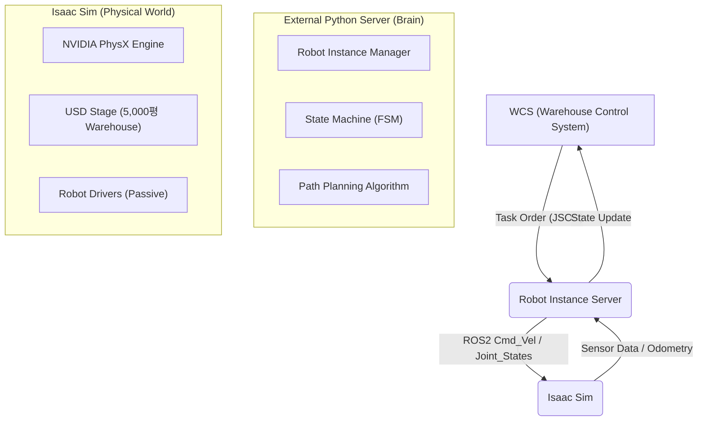
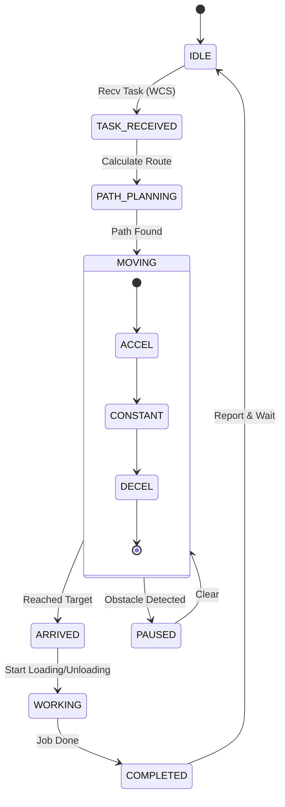
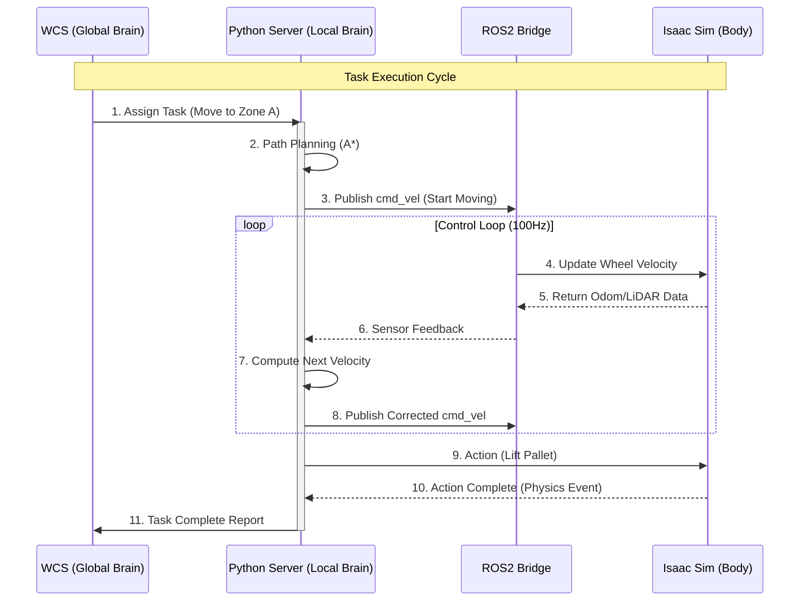

# WCS 및 로봇 객체 제어 시스템 아키텍처

> **핵심 개념 정의**
>
> 1.  **WCS (Warehouse Control System)**: 환경 정보를 바탕으로 전체 물류 흐름을 조율하고 Task를 발행하는 **Global Brain**
> 2.  **Robot Instance Server (Python)**: 개별 로봇의 상태(State Machine)와 로직을 관리하며 실제 제어 명령을 생성하는 **Fleet Manager / Local Brain**
> 3.  **Isaac Sim**: 물리 값을 계산하고 명령을 시각적/물리적으로 수행하여 결과를 리턴하는 **Passive Execution Layer (Body)**

---

## 🏗️ 1. 시스템 전체 아키텍처

전체 시스템은 **3계층 구조 (3-Tier Architecture)** 로 구성됩니다. Isaac Sim은 연산 로직을 최소화하고 시각화와 물리 계산에 집중하며, 모든 제어 로직은 외부 Python 서버에서 수행됩니다.



---

## 🧠 2. 계층별 상세 역할 및 기능

### 2-1. Tier 1: WCS (Warehouse Control System)
> **"환경을 이해하고 명령을 내리는 사령관"**

WCS는 개별 로봇의 구동 방식(어떻게 움직이는지)은 알 필요가 없습니다. 오직 **"무엇을 해야 하는지(What to do)"** 에만 집중합니다.

*   **주요 역할**:
    *   **Global Task Scheduling**: 전체 물류 오더를 접수하고 우선순위를 정합니다.
    *   **Task Assignment**: 현재 로봇들의 위치와 상태(가용 여부)를 분석하여 최적의 로봇에게 작업을 할당합니다.
    *   **Traffic Management**: 로봇 간의 교착 상태(Deadlock)를 방지하기 위해 구역 점유(Zone Allocation)를 관리합니다.
*   **데이터 흐름**:
    *   **Input**: 창고 레이아웃 맵, 작업 대기 리스트, 로봇들의 실시간 위치 및 상태
    *   **Output**: `Task_ID`, `Target_Location`, `Action_Type` (Move, Lift, Drop)

### 2-2. Tier 2: Robot Instance Server (External Python)
> **"로봇의 지능과 영혼이 존재하는 곳"**

실제 로봇 소프트웨어가 구동되는 핵심 영역입니다. Isaac Sim 안에 스크립트를 넣는 것이 아니라, **외부 독립 프로세스**로 존재합니다.

*   **구조적 특징**:
    *   **객체 지향 설계 (OOP)**: 각 로봇(AMR #1, Forklift #3)은 하나의 Python Class Instance로 생성됩니다.
    *   **상태 머신 (FSM)**: 각 인스턴스는 자신의 상태를 관리합니다.
     *   **상태 머신 (FSM)**: 각 인스턴스는 자신의 상태를 관리합니다.
        *   `IDLE` → `TASK_RECEIVED` → `PATH_PLANNING` → `MOVING` → `ARRIVED` → `WORKING` → `COMPLETED`

#### 🔄 Robot State Machine Diagram


*   **주요 기능**:
    *   **경로 생성 (Path Planning)**: WCS가 준 `Target`까지 가는 구체적인 경로(Waypoints)를 계산합니다 (A* 알고리즘 등).
    *   **제어 명령 변환**: 경로를 추종하기 위한 바퀴 속도(`linear_x`, `angular_z`)를 계산하여 토픽을 발행합니다.
    *   **상태 보고**: 자신의 배터리 잔량, 현재 위치, 작업 진행률을 WCS로 보고합니다.

### 2-3. Tier 3: Isaac Sim (Simulation Layer)
> **"명령을 수행하는 정밀한 육체"**

로직 없이 순수하게 **'물리적 현상'** 만을 담당합니다.

*   **동작 방식 (Passive Mode)**:
    *   외부(Tier 2)에서 `cmd_vel` 메시지가 오면 바퀴를 굴립니다.
    *   외부에서 `lift_joint_position` 명령이 오면 포크를 들어올립니다.
*   **피드백 제공**:
    *   가상 LiDAR, 카메라 센서 값을 생성하여 외부로 보냅니다.
    *   충돌(Collision) 발생 시 물리적 반작용을 시뮬레이션하고 충돌 이벤트를 전송합니다.

---

## 🔌 3. 데이터 인터페이스 명세 (예시)

### 3-1. WCS ↔ Python Server (REST API or Socket)
기계보다는 논리적인 업무 지시가 오고 갑니다.

**[Request: Task Assignment]**
```json
{
  "timestamp": "2024-05-20T10:00:00",
  "task_id": "JOB_20240520_001",
  "assigned_robot_id": "AMR_05",
  "action": "TRANSPORT",
  "source": {"x": 10.5, "y": 30.2, "z": 0.0},
  "destination": {"x": 55.0, "y": 12.8, "z": 0.0},
  "item_type": "PALLET_A"
}
```

### 3-2. Python Server ↔ Isaac Sim (ROS2 Topics)
실시간 제어를 위한 고속 데이터 통신입니다.

| Topic Name | Type | Direction | Description |
| :--- | :--- | :--- | :--- |
| `/amr_05/cmd_vel` | `geometry_msgs/Twist` | Python → Sim | 로봇 이동 속도 명령 |
| `/amr_05/lift_joint` | `std_msgs/Float64` | Python → Sim | 지게차 포크 높이 제어 |
| `/amr_05/odom` | `nav_msgs/Odometry` | Sim → Python | 로봇의 현재 위치 및 속도 피드백 |
| `/amr_05/lidar` | `sensor_msgs/LaserScan` | Sim → Python | 장애물 감지용 센서 데이터 |

### 3-3. System Sequence Diagram



---

## 📈 4. 개발 및 운영 이점

1.  **로직과 환경의 분리 (Decoupling)**:
    *   시뮬레이터를 Unity나 Unreal로 바꾸더라도, 혹은 **실제 로봇**으로 교체하더라도 **Python Server(Tier 2) 코드는 90% 이상 재사용 가능**합니다.
    *   Sim-to-Real 전환 시 가장 강력한 아키텍처입니다.

2.  **디버깅 효율성**:
    *   로봇이 이상하게 움직일 때, 그것이 물리 엔진 문제인지(Isaac Sim), 판단 로직 문제인지(Python Server) 명확하게 구분하여 디버깅할 수 있습니다.

3.  **확장성 (Scalability)**:
    *   로봇이 100대로 늘어나면 Python Server만 스케일업(서버 증설)하면 되며, Isaac Sim 렌더링 부하와는 별개로 연산을 처리할 수 있습니다.
