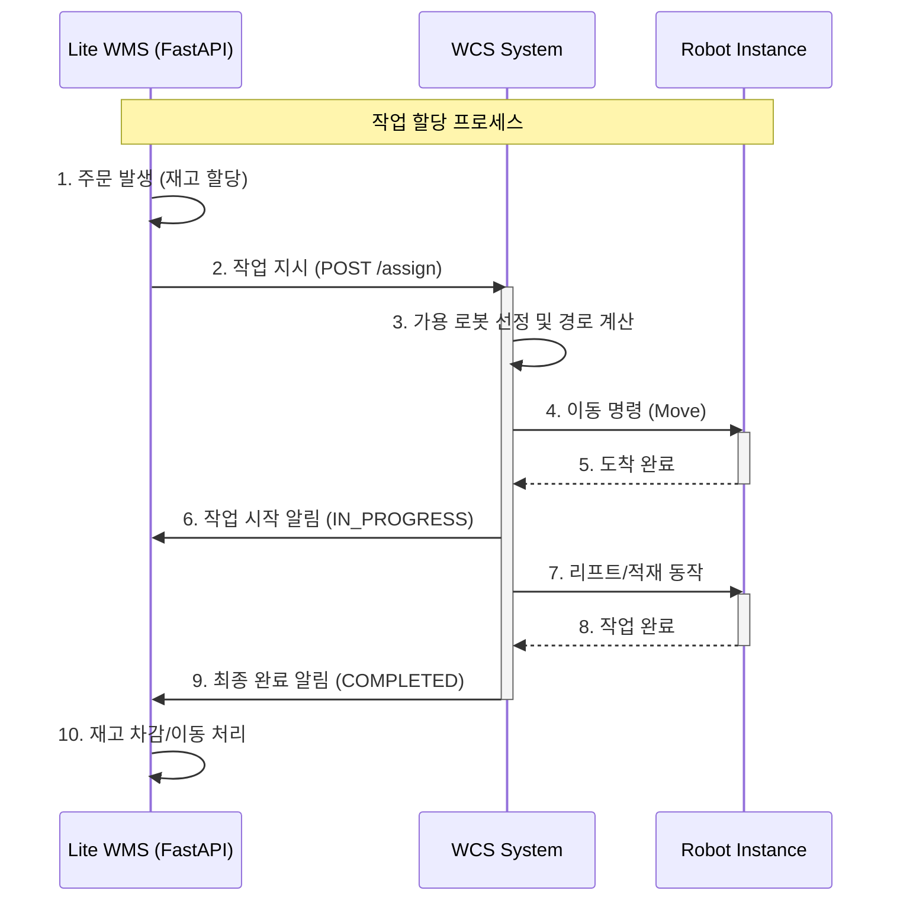

# WMS-WCS 연동 전략 및 개발 규모 분석

> **분석 목적**
> 1.  물류 관리의 최상위 시스템인 **WMS (Warehouse Management System)**와 로봇을 제어하는 **WCS (Warehouse Control System)** 간의 효율적인 연동 방식을 정의합니다.
> 2.  본 디지털 트윈 프로젝트(1인 개발) 범위 내에서 구현 가능한 수준의 **"Lite WMS"** 개발 규모를 산정합니다.

---

## 🔗 1. WMS vs WCS 역할 정의 및 경계

두 시스템은 명확히 다른 역할을 수행하며, 이 경계가 모호해지면 시스템 복잡도가 급증합니다.

| 구분 | **WMS (Warehouse Management System)** | **WCS (Warehouse Control System)** |
| :--- | :--- | :--- |
| **핵심 역할** | **"무엇을(What)"** 관리 | **"어떻게(How)"** 수행 |
| **관리 대상** | 재고(Inventory), 로케이션(Location), 주문(Order) | 설비(Forklift, AMR, Conveyor), 경로(Path) |
| **주요 데이터** | SKU 정보, 수량, 유통기한, 보관 위치 | 로봇 좌표, 배터리 잔량, 모터 속도 |
| **디지털 트윈 내 역할** | **작업 지시 생성기 (Order Generator)** | **작업 수행기 (Task Executor)** |

---

## 🔌 2. 연동 아키텍처 (Interface Strategy)

본 프로젝트에서는 복잡한 미들웨어 없이 **RESTful API** 방식을 채택하여 **경량화 및 개발 속도**를 최우선으로 합니다.

### 2-1. 통신 프로토콜 제안
*   **방식**: HTTP REST API (JSON)
*   **이유**: Python(FastAPI/Flask) 기반으로 빠르게 구축 가능하며, 디버깅이 쉽습니다. (Legacy 창고에서 쓰는 DB Link 방식은 지양)

### 2-2. 데이터 인터페이스 명세 (Standard Interface)

**1) 작업 지시 (WMS → WCS)**
```json
POST /api/v1/task/assign
{
  "order_id": "ORD_20240520_001",
  "priority": "HIGH",
  "job_type": "OUTBOUND",  // 입고, 출고, 재고이동
  "sku_id": "BOX_TYPE_A",
  "source_location": "RACK_A_01_02",  // WMS가 관리하는 논리적 위치
  "target_location": "DOCK_01"
}
```

**2) 작업 결과 피드백 (WCS → WMS)**
```json
POST /api/v1/task/callback
{
  "order_id": "ORD_20240520_001",
  "status": "COMPLETED", // or FAILED
  "completed_at": "2024-05-20T10:15:30",
  "error_msg": null
}
```

### 2-3. Interface Sequence Diagram



---

## ⏱️ 3. 개발 규모 및 구축 전략 (1인 개발 기준)

상용급 WMS를 구축하는 것은 불가능하므로, 시뮬레이션을 위한 **"재고 관리 기능이 포함된 Order Emulator"** 수준으로 범위를 한정합니다.

### 3-1. 개발 범위 (Scope)
1.  **재고 마스터 (Master Data)**: 5,000평 창고 랙(Rack)의 논리적 주소 매핑 (엑셀 Import 기능).
2.  **주문 생성기 (Generator)**: 랜덤 또는 시나리오 기반으로 입/출고 주문을 자동 생성하는 스크립트.
3.  **API 서버**: WCS에 명령을 보내고 결과를 받는 웹 서버.
4.  **대시보드 (UI)**: 현재 주문 현황과 재고 상태를 텍스트로 보여주는 간단한 웹 페이지.

### 3-2. 예상 공수 산정 (Estimation)
> **총 1.5주 (Week 7-8 구간 활용)**

| 구분 | 상세 내용 | 예상 기간 | 난이도 |
| :--- | :--- | :--- | :--- |
| **DB 설계** | SQLite 활용 (Items, Inventory, Orders, Locations 테이블) | 2일 | Low |
| **API 개발** | FastAPI 활용, WCS 연동 인터페이스 구현 | 3일 | Low-Mid |
| **UI 개발** | Streamlit 또는 기본 HTML (관리자용 모니터링) | 2일 | Low |
| **연동 테스트** | WCS(Python Server)와 송수신 통합 테스트 | 2일 | Mid |

### 3-3. 구현 기술 스택 (추천)
*   **Language**: Python 3.10+
*   **Framework**: **FastAPI** (WCS 연동성 최우수)
*   **Database**: **SQLite** (파일 기반, 설치 불필요, 백업 용이)
*   **Admin UI**: **Streamlit** (파이썬 코드로만 웹 대시보드 제작 가능, 프론트엔드 작업 최소화)

---

## 📊 4. 실제 상용 프로젝트와의 차이점 (참고)

향후 이 디지털 트윈이 실제 현장에 도입될 때, WMS/WCS 파트에서 고려해야 할 확장성 이슈입니다.

| 구분 | 디지털 트윈 (Lite Version) | 실제 상용 현장 (Real Field) |
| :--- | :--- | :--- |
| **재고 정확도** | 100% (가상 데이터) | 불일치 발생 (동기화 로직 복잡) |
| **예외 처리** | 통신 에러 정도만 처리 | 네트워크 단절, 재부팅, 트랜잭션 롤백 필수 |
| **사용자** | 개발자 1명 (자동화) | 창고 작업자 수십 명 (PDA/키오스크 연동 필요) |
| **연동 대상** | 자체 구축 Python WCS | SAP, Oracle 등 레거시 ERP/WMS (연동 비용 ↑) |

## 💡 결론
본 프로젝트(1인 개발)에서는 **WMS를 별도의 거창한 시스템으로 만들지 않고**, WCS 서버 내부의 **"Admin 모듈" 또는 "별도의 FastAPI 컨테이너"** 형태로 가볍게 구현하는 것이 가장 효율적입니다.

> **전략 요약**:
> **"복잡한 재고 로직은 덜어내고, '로봇에게 일을 시키는 기능'에 집중한 Lite WMS를 FastAPI + Streamlit으로 1.5주 만에 구축한다."**
