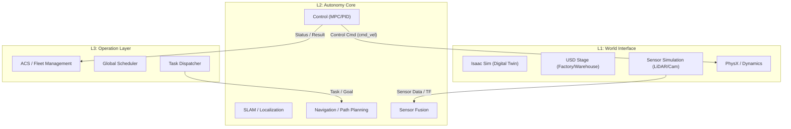

# 디지털 트윈 & 로봇 자율주행 3-Layer 아키텍처

> **R&R 정의 및 계층별 역할 분담**
>
> 본 문서는 물류 로봇 시스템을 **운영(L3) - 지능(L2) - 환경(L1)**의 3계층으로 구분하여, 각 레이어의 역할과 책임 소재를 명확히 정의합니다. 이를 통해 각 파트의 개발 범위를 명확히 하고 통합 시 혼선을 방지합니다.

---

## Executive Summary

성공적인 물류 디지털 트윈 구축을 위해 시스템을 세 가지 핵심 계층으로 모듈화합니다.
*   **L3 (Top)**: 물류 운영 및 관제 (Brain/Scheduler)
*   **L2 (Core)**: 로봇 자율주행 지능 (Mind/Algorithm)
*   **L1 (Bottom)**: 가상 환경 및 물리 시뮬레이션 (Body/World)

각 계층은 **ROS2**를 공통 언어로 사용하여 통신하지만, 책임과 관리 범위는 엄격히 분리됩니다.

---

## 1. 3-Layer Architecture Structure

---

## 2. 계층별 상세 역할 및 R&R

### 2-1. L3 (Top): Operation / ACS Interface Layer
> **"전체 물류 흐름을 관장하는 사령관"**

*   **Layer 정의**: **Operation / ACS Interface Layer**
*   **핵심 역할**: 물류 운영 목표(주문 처리, 물동량)를 달성하기 위해 Task를 분해하고 로봇에게 작업을 할당합니다.
*   **시스템 책임 범위**:
    *   **Fleet Management**: 다수의 로봇 관리, 배터리 충전 스케줄링.
    *   **Traffic Control (ACS)**: 교차로 제어, 교착 상태 해소.
    *   **WES/WCS Logic**: 상위 시스템(ERP/WMS)과의 연동 및 주문 처리.
*   **ROS2 관계**: **외부(Web/DB) → ROS2로 메시지 발행 (Publisher)**
    *   로봇 단위의 상세 제어보다는 `Goal`(목적지)를 던져주는 역할입니다.

### 2-2. L2 (Core): Autonomy / ROS2 Core Intelligence Layer
> **"스스로 판단하고 움직이는 로봇의 지능"**

*   **Layer 정의**: **Autonomy / ROS2 Core Intelligence Layer**
*   **핵심 역할**: 주어진 Task를 안전하고 정확하게 수행하기 위해 센서 데이터를 분석하고 주행 제어를 생성합니다.
*   **시스템 책임 범위**:
    *   **Perception & Fusion**: 센서 데이터 처리 및 객체 인식.
    *   **SLAM**: 위치 추정 및 지도 매핑.
    *   **Planning**: 장애물 회피, 지역 경로 생성 (Local Planner).
    *   **Control**: 모터 제어 명령 생성.
*   **ROS2 관계**: **ROS2 내부 핵심 커널 (Kernel)**
    *   `Map`, `Odom`, `Scan` 데이터를 소비하고 `cmd_vel`을 생산하는 핵심 노드들의 집합입니다.

### 2-3. L1 (Bottom): World / Digital Twin Interface Layer
> **"물리 법칙이 작용하는 가상공간과 육체"**

*   **Layer 정의**: **World / Digital Twin Interface Layer**
*   **핵심 역할**: 실제 현장과 동일한 물리적 환경을 제공하고, 로봇 하드웨어를 가상화하여 센서 데이터를 생성합니다.
*   **시스템 책임 범위**:
    *   **Scene Composition**: 5,000평 물류센터 3D 모델링 (USD).
    *   **Physics Engine**: 마찰, 중력, 관성 등 물리 법칙 적용 (PhysX).
    *   **Sensor Simulation**: 실제 센서와 동일한 노이즈 레벨의 가상 센서 데이터 생성.
    *   **ROS Bridge**: 시뮬레이션 데이터를 ROS2 토픽으로 변환하여 송출.
*   **ROS2 관계**: **외부(Sim) → ROS2로 센서 데이터 공급 (Sensor Feeder)**
    *   L2가 판단할 수 있도록 눈(Camera)과 귀(LiDAR) 역할을 수행합니다.

---

## 3. 데이터 인터페이스 및 기술 스택 요약

| 구분 | L3 (Operation) | L2 (Autonomy) | L1 (World) |
| :--- | :--- | :--- | :--- |
| **Layer 특성** | **Brain & Scheduler** | **Algorithm Core** | **Physical Environment** |
| **주요 Tech Stack** | ACS, Workflow Engine, Web Server | PyTorch, SLAM, Nav2, Control Algo | NVIDIA Omniverse, Isaac Sim, USD |
| **Input Data** | 주문(Order), KPI, 운영 정책 | Task/Goal, Sensor Data, TF | Scene Assets, Physics Params |
| **Output Data** | Task, Goal, Job Topic | Trajectory, `cmd_vel` | Camera, LiDAR, IMU, TF Topic |

### Collaboration Point
1.  **L3 ↔ L2**: 운영 레이어(L3)는 자율주행 레이어(L2)의 `Action Server`를 호출하여 작업을 지시합니다.
2.  **L2 ↔ L1**: 자율주행 알고리즘(L2)은 디지털 트윈 환경(L1) 위에서 구동되며, L1이 제공하는 센서 데이터를 소비합니다.
3.  **L1 ↔ L3**: 디지털 트윈 레이어(L1)는 운영 시나리오 검증(L3)을 위해 다양한 환경 변수(장애물 배치, 물동량 부하)를 제공합니다.
