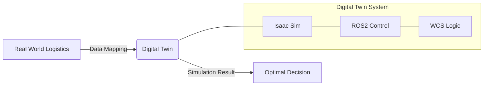
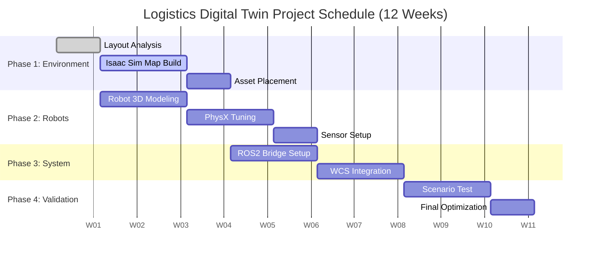

# 물류 디지털 트윈 구축 분석 보고서

> **프로젝트 개요: 5,000평 규모 물류 센터 디지털 트윈 구축**
>
> 본 문서는 엔지니어가 아닌 기획자 및 PM을 대상으로 작성되었으며, NVIDIA Isaac Sim 기반의 물류 디지털 트윈 구축에 필요한 자원, 일정, 비용 및 프로세스를 분석합니다.

## 📋 Executive Summary

본 프로젝트는 최신 **NVIDIA Isaac Sim** 플랫폼을 활용하여 5,000평 규모의 물류 센터를 가상 공간에 구현하고, **WCS(Warehouse Control System)** 및 **ROS2** 기반의 로봇 제어 시스템을 연동하는 것을 목표로 합니다.

- **핵심 목표**: 실물 투입 전 가상 검증을 통한 시행착오 최소화 및 운영 효율화
- **주요 대상**: Forklift(지게차), AMR(자율주행 이송 로봇)
- **투입 리소스**: 개발자 1명 (Full-Stack Sim & System)
- **기대 효과**: 물리적 설비 도입 전 시뮬레이션을 통한 레이아웃 검증 및 시나리오 테스트

### 🖼️ Concept Overview

---

## 🏗️ 1. 프로젝트 범위 및 요구사항

### 1-1. 개발 환경 및 도구
| 구분 | 상세 내용 | 비고 |
| :--- | :--- | :--- |
| **시뮬레이션 엔진** | **NVIDIA Isaac Sim** (최신 버전) | 고정밀 물리 엔진 및 RTX 렌더링 |
| **물리 엔진** | **PhysX 5** 또는 Newton | 충돌 감지, 마찰, 역학 계산 (Isaac Sim 기본: PhysX) |
| **미들웨어** | **ROS2** (Robot Operating System 2) | 로봇 제어 통신 표준 |
| **관제 시스템** | **WCS** (Warehouse Control System) | 물류 흐름 제어 및 명령 하달 |

### 1-2. 대상 환경 및 객체
- **공간**: 5,000평 규모의 단일 물류 창고
- **환경 구성**: Isaac Sim 내장 **Sample Assets** (Warehouse, Racks, Pallets) 활용하여 비용/시간 단축
- **주요 동적 객체**:
  1.  **Forklift (지게차)**: 팔레트 상/하차 작업 시뮬레이션
  2.  **AMR (자율이송로봇)**: 경로 주행 및 물류 이송

---

## 🗓️ 2. 개발 프로세스 및 일정 추론 (1인 기준)

전체 프로젝트 기간은 **약 12주 (3개월)**로 예상되며, **1명의 개발자**가 순차적이고 효율적으로 작업을 수행하는 것을 가정합니다.

### Phase 1: 환경 구축 (Weeks 1-3)
> **"가상 세계의 뼈대 만들기"**
- **주요 활동**:
  - 5,000평 규모의 바닥(Floor) 및 벽체(Wall) 생성
  - Isaac Sim Sample Asset을 활용한 랙(Rack) 및 컨베이어 배치
  - 조명 및 기본 물리 속성(마찰, 중력) 설정
- **기획자 체크포인트**:
  - 실제 도면과 가상 환경의 레이아웃 일치 여부 확인 (대략적 배치)

### Phase 2: 객체 모델링 및 물리 적용 (Weeks 4-6)
> **"로봇에 생명 불어넣기"**
- **주요 활동**:
  - Forklift 및 AMR의 3D 모델(USD 포맷) 확보 및 Import
  - **PhysX/Newton** 물리 엔진 적용 (질량, 바퀴 마찰력, 조향 각도 등)
  - 센서(LiDAR, Camera) 부착 및 데이터 입출력 테스트
- **난이도**: ⭐⭐⭐⭐ (물리 엔진 튜닝에 시간 소요 예상)

### Phase 3: 시스템 연동 (WCS & ROS2) (Weeks 7-10)
> **"두뇌와 신체 연결"**
- **주요 활동**:
  - **ROS2 Bridge** 연결: Isaac Sim ↔ ROS2 간 통신 구축
  - **WCS 연동**: WCS의 작업 명령(Job Order)을 로봇이 수신하여 움직이도록 로직 구현
  - Multi-Robot Navigation (여러 대의 AMR이 서로 피해서 이동하는지) 검증
- **기획자 체크포인트**:
  - WCS에서 명령을 내렸을 때 시뮬레이션 속 로봇이 즉시 반응하는지 확인

### Phase 4: 시나리오 검증 및 최적화 (Weeks 11-12)
> **"운영 리허설"**
- **주요 활동**:
  - 시나리오 테스트: 입고 → 적치 → 출고 프로세스 전체 시뮬레이션
  - 성능 최적화: 5,000평 환경에서 프레임 드랍 없이 시뮬레이션 구동 튜닝
  - 최종 보고서 작성

---

## 💰 3. 비용 및 리소스 분석

### 3-1. 예상 투입 공수 (Man-Months)
- **총 공수**: 1명 × 3개월 = **3 MM (Man-Months)**
- **역할 분담 (1인 통합)**:
  - **Simulation & System Engineer (Full-Stack)**:
    - 환경 구축 및 Asset 관리
    - 물리 엔진(PhysX) 튜닝
    - ROS2 통신 및 WCS 연동 로직 전체 담당

### 3-2. 인프라 비용 추산 (하드웨어/소프트웨어)
기존 개발 장비가 없다고 가정할 경우의 대략적인 견적입니다.

| 항목 | 상세 | 예상 비용 (대략) |
| :--- | :--- | :--- |
| **Workstation** | RTX 4090급 GPU 탑재 PC (1대) | 약 600만원 |
| **Software** | Isaac Sim (Free/Enterprise), OS 등 | 무료 (오픈소스 활용 시) |
| **Asset** | 유료 3D 모델 구매 (필요 시) | 약 100만원 (예비비) |
| **Total** | | **약 700만원 + 인건비** |

> *참고: NVIDIA Omniverse Enterprise 라이선스 도입 시 별도 비용 발생 가능 (POC 단계에서는 무료 버전 활용 권장)*

---

## 📊 4. 기술적 타당성 및 리스크

### ✅ Pros (선택의 장점)
- **Isaac Sim Sample Asset 활용**: 5,000평을 바닥부터 모델링하지 않고, 미리 만들어진 고품질 에셋을 사용하여 **구축 시간을 50% 이상 단축** 가능합니다.
- **PhysX 5의 정밀함**: 지게차의 무거운 하중 이동이나 AMR의 미끄러짐 등을 실제와 매우 유사하게 모사하여, **시뮬레이션 신뢰도**가 높습니다.
- **확장성**: 추후 로봇 대수가 늘어나거나(100대 이상), 환경이 바뀌어도 유연하게 대응 가능합니다.

### ⚠️ Risks (고려사항)
- **고사양 하드웨어 요구**: 5,000평 규모의 대형 맵과 다수 로봇 시뮬레이션은 높은 GPU 성능을 요구합니다. (RTX 3090/4090 이상 필수)
- **러닝 커브**: Isaac Sim과 ROS2 연동은 진입 장벽이 다소 있어, 초기 2주간은 개발 속도가 더딜 수 있습니다.

---

## 💡 결론 및 제언

이 프로젝트는 **단기간(3개월) 내에 단 1명의 리소스**로 물류 센터의 효율성을 검증할 수 있는 매우 가성비 높은 접근 방식입니다.

**기획자를 위한 한 줄 요약**:
> "실제 창고를 짓고 로봇을 사서 테스트하려면 **수십 억**이 들지만, 이 디지털 트윈 프로젝트는 **개발자 1명과 PC 1대**로 3개월 만에 그 결과를 미리 예측해볼 수 있습니다."

**추천 다음 단계**:
1. 5,000평 도면(CAD) 확보 및 레이아웃 확정
2. 대상 로봇(Forklift, AMR)의 정확한 스펙(치수, 속도, 회전반경) 데이터 수집
