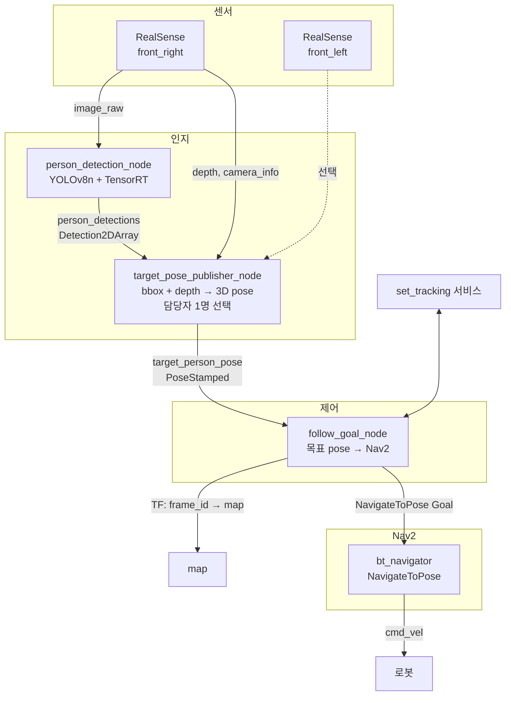
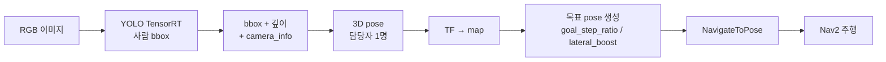
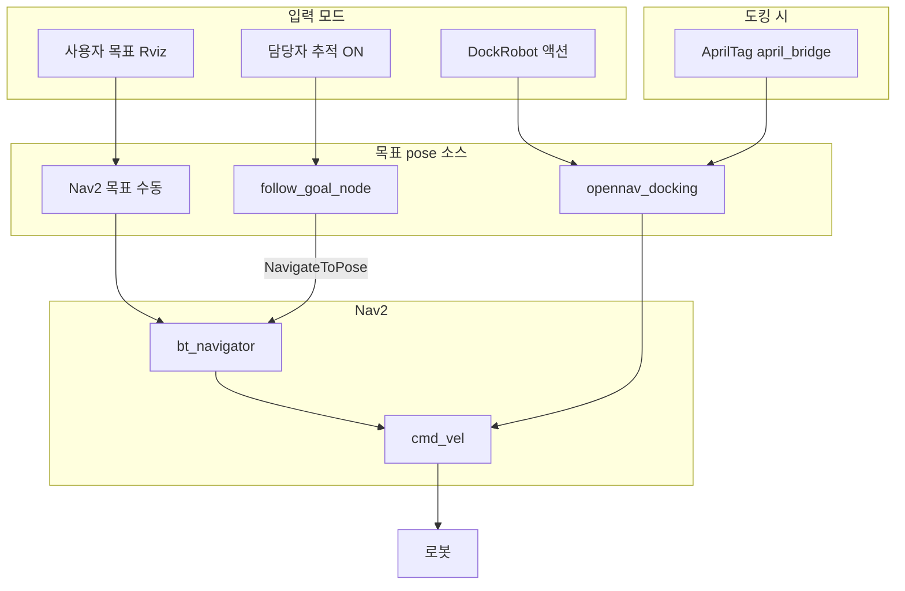
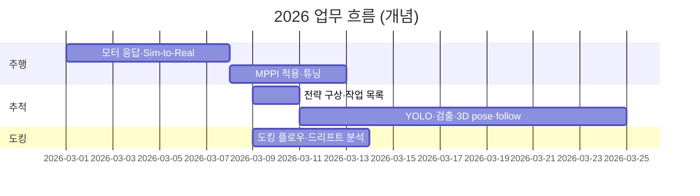

# 2026년 AMR RDS 개발 요약

**작성일: 2026-03-11**  
**프로젝트:** 자율주 · 담당자 추적 주행 · 도킹 · Nav2

---

## 1. 개요

2026년 상반기(~3월)까지 진행한 **로봇 주행·인지·도킹** 관련 업무를 정리한 문서입니다.  
**Sim-to-Real 정규화**, **Nav2 MPPI 적용**, **담당자(사람) 추적 주행 파이프라인**, **도킹 플로우 문서화** 등이 포함됩니다.

---

## 2. 업무 영역 요약

| 영역 | 내용 | 산출 |
|------|------|------|
| **주행 안정화** | 모터 가·감속 파라미터화(200ms), Nav2 MPPI 컨트롤러 적용·튜닝, Sim-to-Real 정규화 | zlac8015d 수정, nav2_params (MPPI), 문서 |
| **담당자 추적 주행** | YOLOv8-nano + TensorRT 사람 검출, RealSense RGB/깊이 → 3D pose, Nav2 목표 갱신 방식 추적 | person_follow_perception 패키지, 런치·파라미터 |
| **도킹** | AprilTag 기반 도킹 플로우 정리, 글로벌맵·환경 변화 시 드리프트 분석 | 도킹 플로우·TF 문서, 대응 방향 정리 |
| **기타** | 백엔드(clicd)·Premise API·QR검版·Kyverno 정책 등 | 해당 모듈 수정·문서 |

---

## 3. 담당자 추적 주행 시스템 (핵심 파이프라인)

담당자(사람) 1명을 **깊이 기준 가장 가까운 사람**으로 선정하고, **Nav2에만 목표 pose를 주기적으로 전달**하여 따라가게 하는 파이프라인입니다.  
**cmd_vel을 직접 내보내지 않고**, 기존 Nav2·도킹 구조를 유지한 채 추가 노드·토픽만 얹은 형태입니다.

### 3.1 전략

- **전략 A:** 담당자 위치 → map 변환 → “목표 = 로봇 + 비율×(사람−로봇)” → **NavigateToPose** 주기 전송 → Nav2가 경로·장애물 회피 후 **cmd_vel** 발행.
- **전략 C:** 추적 모드 ON/OFF(서비스 `set_tracking`)로 동작 제어. OFF 시 목표 전송 중단.

### 3.2 시스템 구성도

### 3.3 데이터 흐름 (개념)

### 3.4 주요 기술 스택

| 구분 | 내용 |
|------|------|
| **플랫폼** | ROS2 Humble, NVIDIA Jetson (JetPack 6.2, CUDA 12.6, TensorRT 10.x) |
| **센서** | RealSense D435I × 2 (전방 좌/우), RGB + depth + camera_info |
| **검출** | YOLOv8-nano, TensorRT 엔진(.engine), person 클래스(COCO id=0) |
| **인지** | bbox 중심 픽셀 깊이 → unproject → camera_optical_link 기준 3D pose, 담당자 = **깊이 최소 1명** |
| **제어** | follow_goal_node: 목표 = 로봇 + goal_step_ratio×(사람−로봇), 좌/우 바깥쪽일 때 lateral_boost_ratio로 더 적극 회전, min_follow_distance 이내면 목표 전송 중단 |
| **주행** | Nav2 (MPPI 컨트롤러), NavigateToPose 액션만 사용, cmd_vel은 Nav2 단일 소스 |

### 3.5 토픽·액션·서비스 요약

| 방향 | 이름 | 타입 | 비고 |
|------|------|------|------|
| → | `/front_*/camera/color/image_raw` | Image | RealSense RGB |
| → | `/front_*/camera/depth/image_rect_raw` | Image | RealSense depth |
| → | `person_detections` | Detection2DArray | 2D bbox 목록 |
| → | `target_person_pose` | PoseStamped | 담당자 3D pose (camera/base_link 등) |
| ⇒ | `navigate_to_pose` | NavigateToPose (액션) | follow_goal_node → bt_navigator |
| ⇄ | `set_tracking` | SetBool (서비스) | 추적 ON/OFF |

---

## 4. 주행 안정화 (Sim-to-Real)

| 항목 | 내용 |
|------|------|
| **모터** | zlac8015d 가·감속 시간 파라미터화, 기본 200ms. 실기에서 Nav2 기대 응답과 괴리 완화. |
| **MPPI** | DWB 대신 Nav2 MPPI 컨트롤러 적용. Critic 가중치·temperature·velocity smoother 튜닝으로 경로 추종·휘청 거림 개선. |
| **문서** | Sim-to-Real 정규화, 글로벌맵·변화 환경에서 도킹 드리프트 원인·대응 방향 정리. |

---

## 5. 도킹

- **흐름:** Nav2로 도킹 근처 이동 → AprilTag(tag_0) 인식 → april_bridge → `/detected_dock_pose` → opennav_docking → **후진** 도킹.
- **문서화:** 도킹 시퀀스, TF(tag_0) → pose 변환, 도킹 서버·cmd_vel 관계 정리. 글로벌맵 변경 시 드리프트 원인 분석 및 추가 테스트 방향 수립.

---

## 6. 구조 (cmd_vel 소스·모드)

- **평소:** Nav2만 /cmd_vel 발행 (목표는 Rviz 또는 follow_goal_node).
- **추적 ON:** follow_goal_node가 NavigateToPose로 목표 갱신 → Nav2가 주행.
- **도킹 시:** 도킹 서버가 /detected_dock_pose 기준으로 /cmd_vel 발행. 모드에 따라 한 쪽만 활성화되는 구조.

---

## 7. 2026 개발발 타임라인 (개념)

---

## 8. 문서·설정 위치 참고

| 구분 | 문서·파일 |
|------|-----------|
| **추적 주행** | 260310_담당자_추적_주행_예상_작업.md, 전략_구상.md, ros2_cmd.md, person_follow_params.yaml |
| **주행·MPPI** | 260309_work_report.md, 260309_sim_to_real_normalization.md, nav2_params_custom (MPPI) |
| **도킹** | 260309_docking_flow.md, 260309_docking_tf_tag0_flow.md, 260309_global_map_vs_changing_env_docking.md |
| **Nav2 분석** | 260303_nav2_sim_vs_real_analysis.md |

---

## 9. 요약

- **담당자 추적 주행:** RealSense + YOLOv8-nano(TensorRT) 사람 검출 → bbox+깊이로 3D pose → 깊이 기준 가장 가까운 1명을 담당자로 선정 → follow_goal_node가 목표 pose만 Nav2에 주기 전송. **주행은 전부 Nav2**, cmd_vel 직접 발행 없음.
- **주행 안정화:** 모터 200ms 가·감속, MPPI 컨트롤러 적용·튜닝으로 Sim-to-Real 차이 완화.
- **도킹:** AprilTag 기반 플로우·TF 문서화, 글로벌맵/환경 변화 시 드리프트 대응 방향 정리.

이 문서는 2026-03-11 기준 개인 포트폴리오용 요약이며, 상세는 각 작업 보고서를 참조하면 됩니다.
