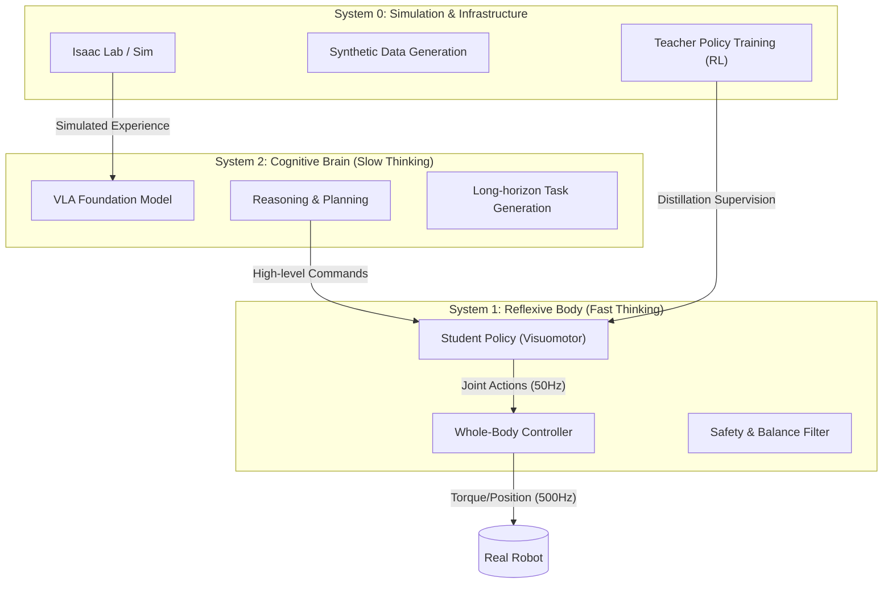
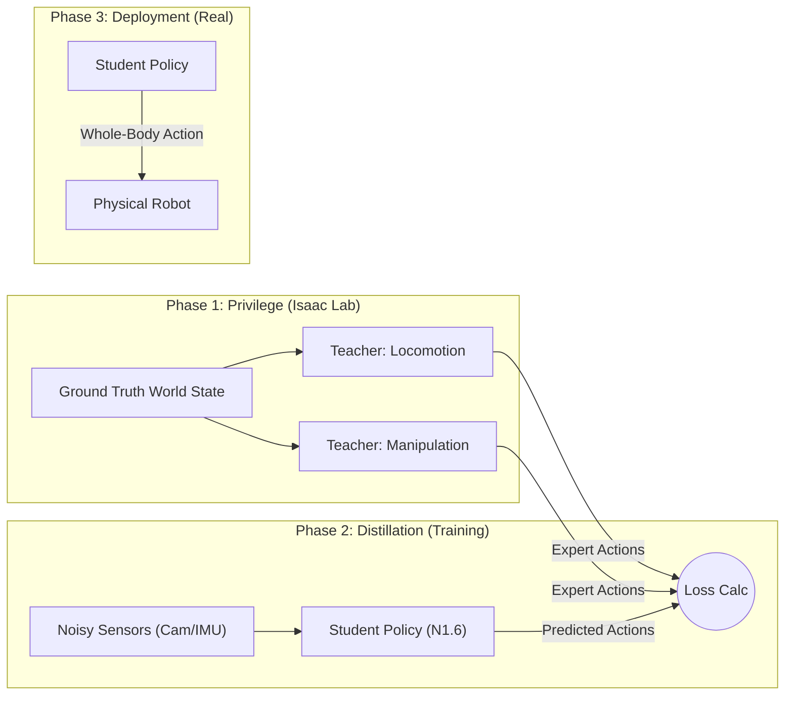

# 04. Whole-Body Control & Loco-Manipulation Strategy (GR00T N1.6 Architecture)

> **전략 개요**
>
> 본 문서는 **NVIDIA GR00T N1.6** 아키텍처를 기반으로 휴머노이드 로봇의 **전신 제어(Whole-Body Control)**와 **이동 조작(Loco-Manipulation)**을 구현하는 기술 전략을 정의합니다.
> 인간의 인지 과정을 모방한 **System 0/1/2** 계층 구조를 채택하고, **Teacher-Student Distillation** 파이프라인을 통해 이동(Locomotion)과 조작(Manipulation) 성능을 동시에 달성하는 것을 목표로 합니다.

---

## 🏗️ 1. GR00T N1.6 기반 System 0-1-2 아키텍처

NVIDIA GR00T의 차세대 아키텍처(N1.6)는 파운데이션 모델 학습과 실시간 제어를 계층적으로 통합하는 **System 0, 1, 2** 구조를 따릅니다.

### 🧠 System 2: Cognitive Brain (지능 및 계획)
*   **역할**: 복잡한 작업 계획, 추론, 멀티모달(Vision+Language) 이해.
*   **기술**: **GR00T N1.6 VLA (Vision-Language-Action)** 모델.
*   **주기**: 1Hz ~ 10Hz (Slow).
*   **기능**: "빨간색 박스를 집어서 컨베이어로 옮겨"와 같은 자연어 명령을 해석하고, 중간 경유지(Waypoint)나 작업의 단계(Phase)를 생성합니다.

### ⚡ System 1: Reflexive Body (반사 및 전신 제어)
*   **역할**: 실시간 균형 유지, 보행, 외란 대응, 즉각적인 조작 수행.
*   **기술**: **Transformer-based Visuomotor Policy (Student)**.
*   **주기**: 50Hz ~ 500Hz (Fast).
*   **기능**: System 2의 상위 명령을 받아 실제 관절 움직임을 생성하며, 넘어지지 않고 물체를 파지하는 **Loco-Manipulation**을 수행합니다.

### 🏭 System 0: Infrastructure (학습 및 데이터)
*   **역할**: 물리 시뮬레이션, 대규모 데이터 생성, Teacher Policy 학습.
*   **기술**: **Isaac Lab (Orbit)**, **DGX Cloud**.
*   **기능**: 수천 개의 병렬 환경에서 로봇을 학습시키고, **Teacher-Student Distillation**을 위한 Ground Truth 데이터를 생산합니다.

---

## 🏃‍♂️ 2. Loco-Manipulation (이동 조작) 전략

휴머노이드가 "걸어가면서(Locomotion) 물체를 조작(Manipulation)"하기 위해서는 상체와 하체의 협응이 필수적입니다. 이를 개별 제어기가 아닌 **Whole-Body Control (WBC)** 관점에서 통합합니다.

### 핵심 도전 과제 (Challenge)
1.  **Dyamic Balancing**: 팔을 뻗어 무거운 물체를 들 때 무게중심(CoM) 이동을 하체가 즉각 보상해야 함.
2.  **Coordination**: 보행 리듬과 팔 동작의 타이밍 동기화.
3.  **Stability**: 이동 중 발생하는 전신 진동이 End-effector(손끝) 정밀도에 미치는 영향 최소화.

### 해결 전략: Unified Whole-Body Policy
개별적인 보행 제어기(MPC)와 팔 제어기(IK)를 쓰는 대신, **하나의 Neural Network가 전신 32-DoF를 동시에 제어**하도록 학습합니다.

---

## 🎓 3. Teacher-Student Distillation Pipeline

성능이 뛰어난 전문가(Teacher)들의 능력을 실제 배포 가능한 하나의 정책(Student)으로 합치는 파이프라인입니다.

### Phase 1: Teacher Policy Training (Specialists)
**Privileged Information(완벽한 상태 정보)**을 사용하여 각 도메인의 최고 성능을 내는 Teacher 모델들을 Isaac Lab에서 강화학습(RL)으로 학습합니다.

*   **Teacher A (Locomotion Specialist)**:
    *   **목표**: 험지 주파, 외력 방어, 넘어지지 않기.
    *   **입력**: 지형 높이맵(Height map), 정확한 마찰계수, 관절 토크 등 (실제에선 알 수 없는 정보 포함).
*   **Teacher B (Manipulation Specialist)**:
    *   **목표**: 정밀 파지, 물체 조작, 도구 사용.
    *   **입력**: 물체의 정확한 Pose(6D), 물성 정보, 완벽한 손끝 위치.

### Phase 2: Student Policy Training (Generalist)
Teacher들의 행동을 모방하되, **실제 로봇이 얻을 수 있는 데이터(Proprioception + Vision)**만으로 학습합니다.

*   **Student Model (GR00T N1.6 Based)**:
    *   **입력**:
        *   **Vision**: Depth/RGB Camera (Egocentric).
        *   **Proprioception**: IMU, Joint Position/Velocity.
        *   **Prior**: 이전 프레임의 Action (History).
    *   **학습 방법 (Distillation)**:
        *   **Behavior Cloning (BC)**: Teacher가 생성한 최적의 Trajectory를 따라 하도록 손실 함수(Loss) 설계.
        *   **DAGGER**: Student가 실수하는 상황에서 Teacher가 개입하여 교정해주는 방식.

### 📝 데이터 흐름 다이어그램

---

## 🚀 4. Implementation Plan

1.  **Isaac Lab 환경 구축**:
    *   Locomotion용 거친 지형(Terrain)과 Manipulation용 작업대(TableEnv)가 결합된 통합 훈련장 구성.
2.  **Teacher 학습**:
    *   `PPO` 알고리즘을 사용하여 상/하체 각각의 Reward Function 최적화.
3.  **Student 학습 (GR00T Fine-tuning)**:
    *   사전 학습된 **GR00T N1.6** 모델을 로드.
    *   Teacher의 Action을 "Label"로 삼아 Supervised Fine-tuning 수행.
    *   **Transformer Backbone**을 동결(Freeze)하거나 LoRA 등을 이용해 효율적 튜닝.
4.  **Hardware Deployment**:
    *   Jetson AGX Orin 탑재.
    *   System 2 (VLA)는 클라우드/엣지 서버 연동, System 1 (Student Policy)은 로컬 추론.

이 전략을 통해 로봇은 **"System 2의 지능으로 계획하고, System 1의 반사신경으로 수행하며, System 0에서 지속적으로 진화"**할 수 있습니다.
