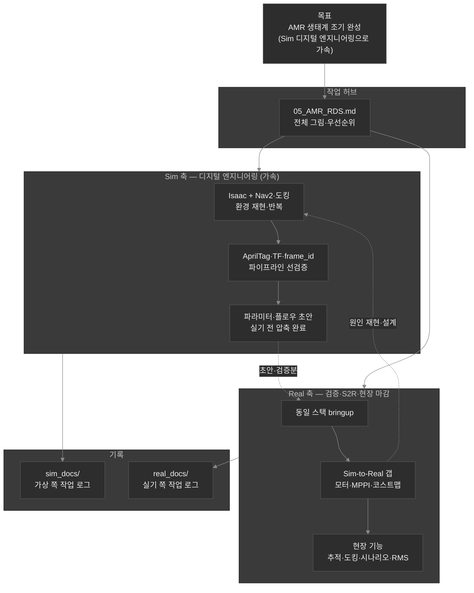
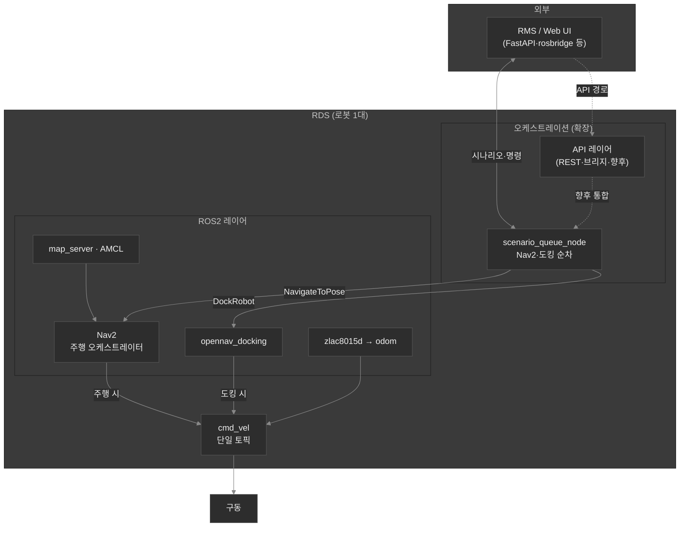
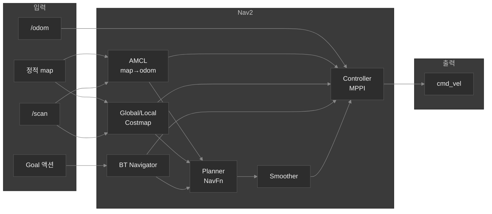
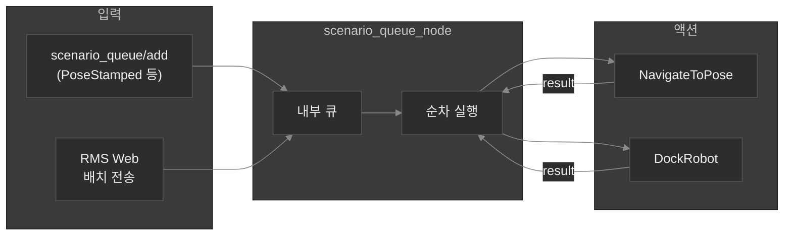
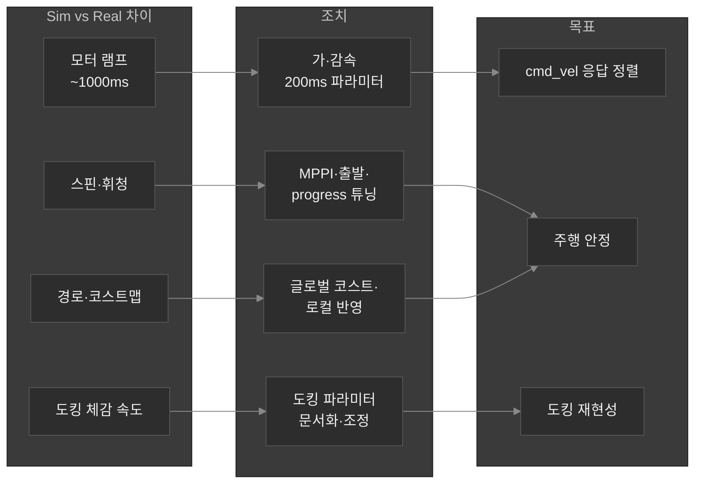
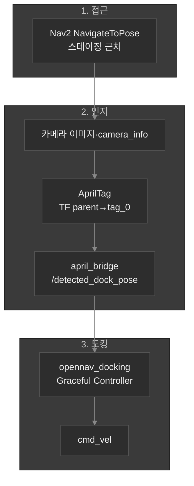
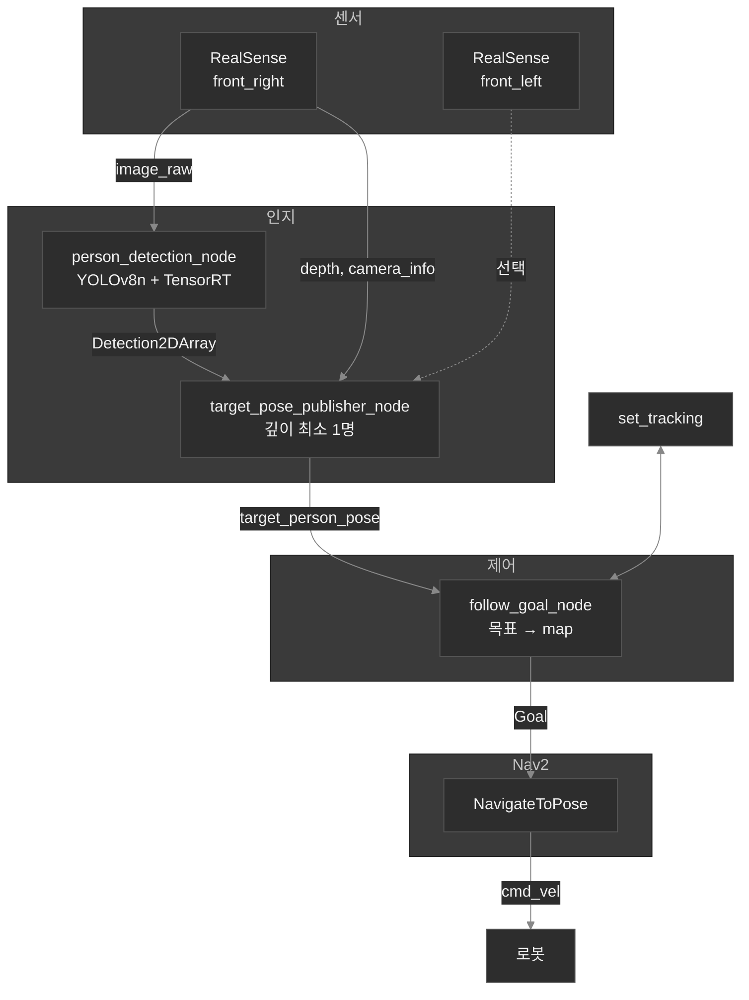
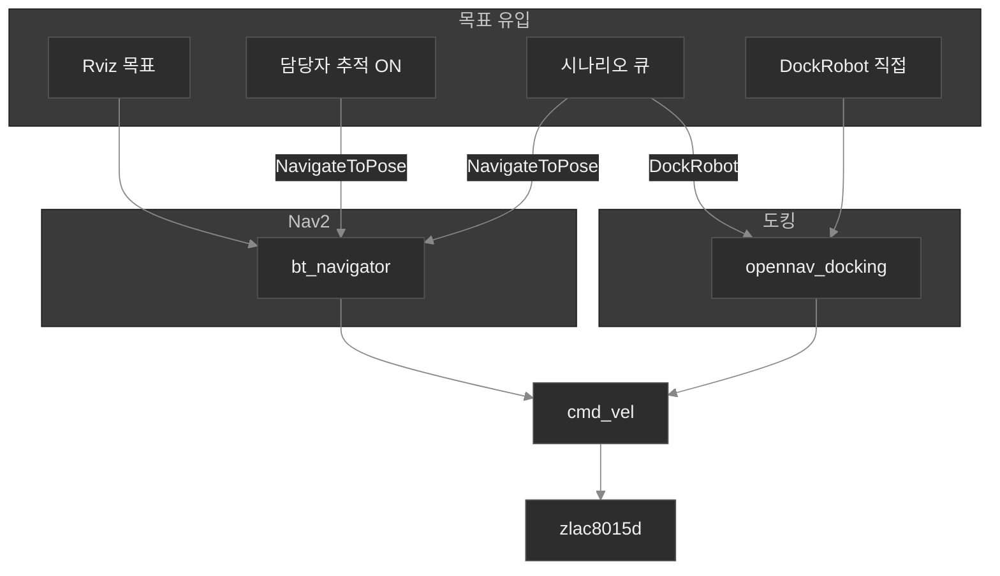
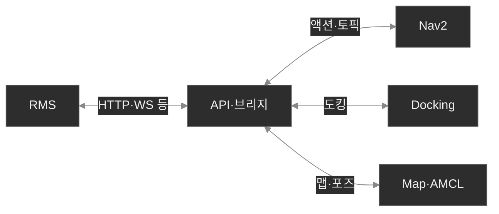
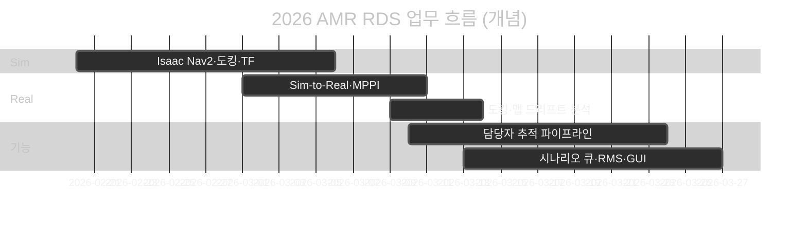

# 2026 AMR RDS · Sim-to-Real 개발 요약

**최종 갱신: 2026-03**  
**프로젝트:** DAVID-C RDS / david50c — 자율주행 · 담당자 추적 · 도킹 · Nav2 · RMS 연동  
**작업 지향:** AMR **전체 생태계를 빠르게 완성** — **Sim 디지털 엔지니어링**으로 개발 가속, Real은 S2R·현장 마감에 집중.  
**상세 원본:** `knowledge_base/05_물류_자동화_시스템/AMR RDS in sim to real/` (2026 개발 과정 문서)

---

## 0. AMR RDS 개발 구조 (Sim · Real 이원화)

**목표:** **AMR 전체 생태계**(주행·도킹·맵·추적·시나리오·RMS·API 등)를 **빠르게 한 바퀴 완성**하는 것.  
그래서 **실기 투입 전에 할 수 있는 일은 최대한 Sim(Isaac)에서 처리**한다. Sim을 **디지털 엔지니어링 허브**로 쓰면 — TF·도킹 파이프라인·Nav2·멀티로봇·USD/카메라 정합 등을 **가상에서 반복 검증**하고, 실기는 **S2R 갭·현장 이슈·튜닝**에 시간을 쓰게 되어 **전체 리드타임이 줄어든다.** 이게 2026 작업의 **가속 타겟**이다.

개발할 때 **가상에서 먼저 깨는 문제**와 **실기(david50c)에서 맞추는 문제**가 다르다.  
`knowledge_base/…/AMR RDS in sim to real` 아래 **sim_docs / real_docs** 나눔은 폴더 규칙이 아니라, 위 목표에 맞춰 **Sim으로 압축한 축**과 **Real로 마감하는 축**을 그대로 옮겨 둔 구조다.

- **Sim 축 (디지털 엔지니어링):** 통제 가능한 가상 환경에서 파이프라인·파라미터 초안·실패 재현을 **빠르게 돌려** 생태계 조각을 **먼저 완성**한다.
- **Real 축:** 모터·MPPI·맵 드리프트·현장 시나리오·RMS 등 **실물 전용 갭**만 실기에서 맞춘다.
- **본 문서(05):** “생태계 어디까지 Sim에서 닫았는지 / Real에서 남았는지”를 한눈에 보는 **작업 대시보드**.

| 내가 쓰는 축 | 디렉터리 | 이 축에서 주로 하는 일 |
|--------------|----------|------------------------|
| **Sim** | `sim_docs/davidc_virtual_testbed/` | USD·카메라·TF·도킹 시퀀스를 Sim에서 끝까지 재현 |
| **Sim** | `sim_docs/work_report/` | Sim 관점 일지, sim↔real 비교 메모 |
| **Real** | `real_docs/work_report/` | 실기 튜닝, 추적 주행, 시나리오 큐, 현장 이슈 |
| **Real·설계** | `real_docs/*.md` (구조·API) | Nav2/RDS 역할 정리, RMS API 전략 등 “실제 배포 전 설계” |

폴더 이름은 **Sim/Real 갈래의 아카이브**이고, 위 다이어그램은 **생태계 조기 완성을 위해 Sim으로 먼저 닫고 Real로 마감하는 흐름**에 맞춰져 있다.

---

## 1. 한눈에 보는 RDS 스택

**RDS** = 로봇 1대당 1세트. 내부는 **ROS2**이며 **Nav2**가 주행 오케스트레이터, **OpenNav Docking**이 도킹 시 cmd_vel을 담당. 외부 **RMS**와는 API·시나리오 큐·Web 등으로 연동하는 방향으로 확장 중이다.

---

## 2. Nav2 = 주행 오케스트레이터

목표 수신부터 **전역 경로 → 스무딩 → MPPI 로컬 제어 → cmd_vel**까지 한 파이프라인으로 묶인다.

| 구성요소 | 역할 |
|----------|------|
| BT Navigator | 목표·리플랜·리커버리 시퀀스 |
| Planner + Costmap | 전역 경로 |
| Controller (MPPI) | 추종·cmd_vel (DWB 대체 튜닝) |
| AMCL | map→odom TF |

---

## 3. 시나리오 큐 (`scenario_queue`) — 2026-03 진행

Nav2 **바깥**에서 **시나리오를 한 건씩** 실행한다. Nav2는 “지금 받은 한 목표”만 수행하고, **순서·큐·Nav+Dock 혼합**은 큐 노드가 담당한다.

**진행 단계 요약 (문서 260313 기준):**  
Nav2만 큐 → 도킹 타입 추가 → 큐 삭제·수정 → 상태·피드백 퍼블리시 → rosbridge + `rms_server` + Web UI → GUI 맵 기반 Nav/Dock·로그 등. **다중 로봇·UX 고도화**는 이후 확장.

---

## 4. Sim-to-Real 정규화 (실기 david50c)

Isaac Sim에서는 양호하나 실기에서 **스핀·휘청·가다 서다·도킹 속도** 이슈가 있어, **모터 → Nav2(코스트·경로) → 도킹** 순으로 맞춤.

| 조치 | 내용 |
|------|------|
| zlac8015d | `accel_time_ms` / `decel_time_ms` 기본 **200ms** |
| Nav2 | MPPI critic·temperature·velocity smoother, 코스트맵 강화 |
| 참고 문서 | `260309_sim_to_real_normalization.md`, `260303_nav2_sim_vs_real_analysis.md`, `260226_isaac_sim_vs_real_spin_wobble_analysis.md` |

---

## 5. 도킹 파이프라인 (AprilTag → cmd_vel)

**실기·Sim 공통 개념:** 근처 이동(Nav2) → 태그 인식 → 브리지 → 도킹 서버 → **후진** 등으로 접촉.

**Sim에서 중요한 점:** `header.frame_id`(예: `camera_optical_link` vs `sim_camera`)를 AprilTag·브리지·**map까지 TF 체인**과 일치시켜야 한다. 상세: `2026-03-05_도킹_apriltag_파이프라인_구조.md`, `260309_docking_tf_tag0_flow.md`.  
**실기 이슈:** 글로벌 맵·환경 변화 시 AMCL 드리프트 → 도킹 정렬 오차. 대응 방향: `260309_global_map_vs_changing_env_docking.md`.

---

## 6. 담당자 추적 주행 (person follow)

**cmd_vel을 직접 내지 않음.** RealSense ×2 + YOLOv8-nano(TensorRT) → 3D pose → **NavigateToPose**만 주기 갱신.

| 항목 | 내용 |
|------|------|
| 플랫폼 | ROS2 Humble, Jetson, TensorRT 10.x |
| 전략 | 목표 = 로봇 + ratio×(사람−로봇), `lateral_boost`, `min_follow_distance` |
| 문서 | `260310_담당자_추적_주행_예상_작업.md`, 전략 구상, `person_follow_params.yaml` |

---

## 7. cmd_vel 소스·모드 (통합 뷰)

---

## 8. RMS · API 레이어 (로드맵)

다수 로봇 **RMS** ↔ 로봇별 **RDS**는 **API 레이어**로 ROS2를 캡슐화하는 것이 목표. REST/gRPC vs ROS2 직접 등 옵션 비교·단계적 노출은 `04-RDS-API-Layer-Analysis-and-Strategy.md` 참고.

**노출 기능 후보:** 주행 목표·취소, 도킹, 맵·초기 포즈, 로봇 상태·헬스.

---

## 9. 업무 영역 요약표

| 영역 | 내용 | 산출·문서 |
|------|------|-----------|
| 주행 안정화 | MPPI, 모터 200ms, 코스트맵 | zlac8015d, nav2_params |
| Sim-to-Real | Isaac ↔ 실기 갭 분석·튜닝 | sim_docs + `260309_sim_to_real_normalization.md` |
| 시나리오·RMS | 큐 노드, Web UI, rms_server | `260313_시나리오_큐_노드_진행.md` |
| 담당자 추적 | YOLO+깊이+Nav2 목표만 | person_follow_* 패키지 |
| 도킹 | AprilTag·TF·Sim frame 정합 | docking_flow, apriltag 파이프라인 문서 |
| API 전략 | RMS 연동 설계 | `04-RDS-API-Layer-Analysis-and-Strategy.md` |
| 기타 | Premise·QR·Kyverno 등 | 각 모듈 work_report |

---

## 10. 타임라인 (개념)

---

## 11. 빠른 링크 (knowledge_base 상대 경로)

| 주제 | 경로 |
|------|------|
| Nav2 구조 | `real_docs/ROS2-RDS-Structure-Nav2-Orchestrator.md` |
| API 전략 | `real_docs/04-RDS-API-Layer-Analysis-and-Strategy.md` |
| Sim 정규화 | `real_docs/work_report/260309_sim_to_real_normalization.md` |
| 도킹 플로우 | `real_docs/work_report/260309_docking_flow.md` |
| 시나리오 큐 | `real_docs/work_report/260313_시나리오_큐_노드_진행.md` |
| AprilTag Sim | `sim_docs/davidc_virtual_testbed/2026-03-05_도킹_apriltag_파이프라인_구조.md` |
| MPPI 튜닝 | `real_docs/work_report/260309_MPPI-performance-tuning-options.md` |

---

## 12. 요약

- **RDS**는 Nav2(주행)·도킹·맵/AMCL·구동으로 구성되며, **2026년에는 시나리오 큐 + RMS Web**으로 다단계 임무를 오케스트레이션한다.
- **Sim-to-Real**은 Isaac 가상 테스트베드에서 TF·도킹 파이프라인을 검증하고, 실기에서는 **모터 응답·MPPI·코스트맵**으로 갭을 줄인다.
- **담당자 추적**은 Nav2만 사용해 장애물 회피를 유지한다.
- **RMS·API**는 다로봇 운영을 위한 다음 레이어로 문서화되어 있다.

본 문서는 **Sim·Real 두 축으로 쌓아 온 2026 작업**을 한 화면에서 잡기 위한 것이고, 구현·실험 디테일은 각 축의 `.md`에 남겨 둔다.
