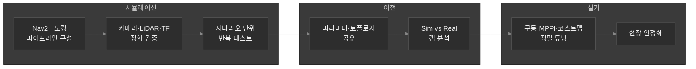
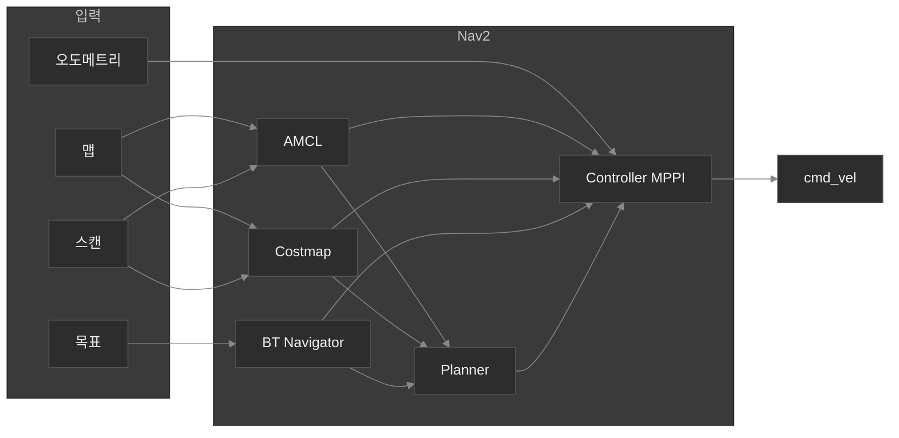
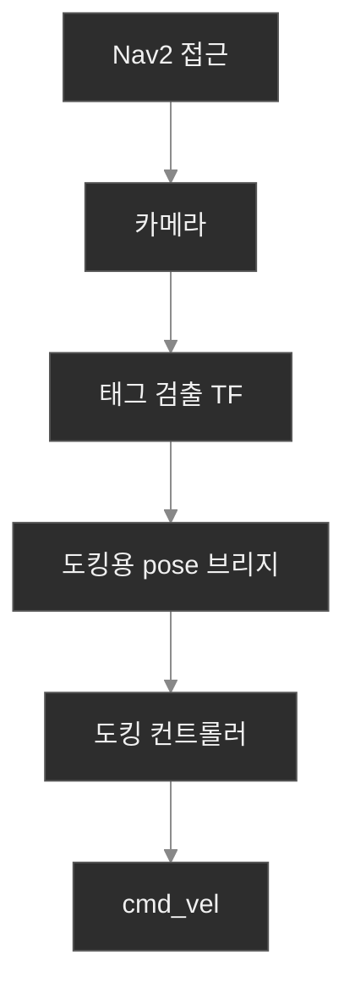
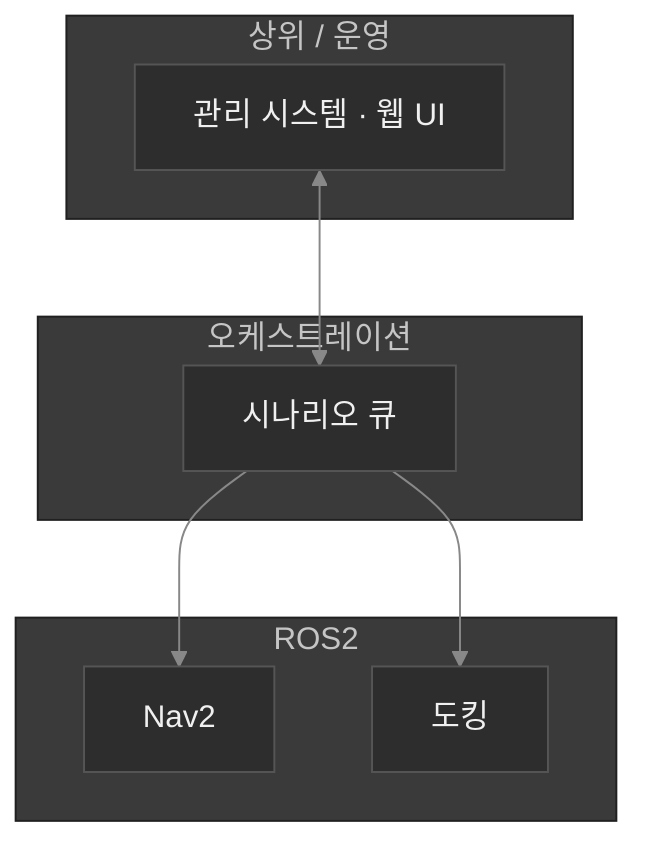
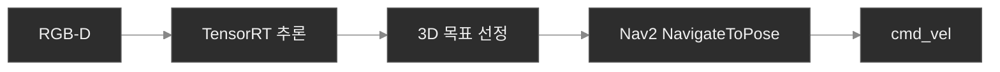
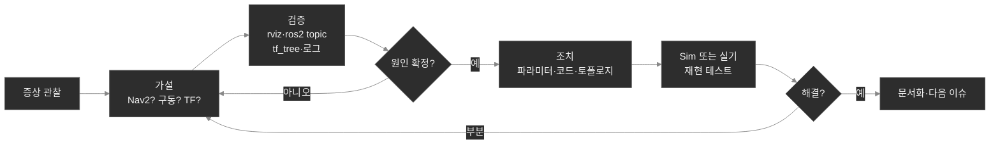

# AMR 자율주행 · Sim-to-Real 개발

**역할:** ROS2 기반 AMR에서 내비게이션·도킹·다단계 임무를 설계·구현하고, **Isaac Sim급 시뮬레이션으로 검증 주기를 앞당긴 뒤** 실기로 이전하는 파이프라인을 구축함. 아래 **개요·구조** 다음에, **문제 해결 사례**를 정리함.

---

## 한 줄 요약

**동일한 Nav2·도킹 스택을 시뮬레이션에서 먼저 검증**하고, 실기와의 괴리(구동 응답·센서·TF)를 체계적으로 줄여 **현장 투입 전 리스크와 반복 비용을 낮추는 것**을 목표로 개발함.

---

## 시뮬레이션으로 개발을 가속하는 방식

물리 로봇만으로는 반복 실험이 느리고 비용이 크다. **가상 환경에서 Nav2 주행·AprilTag 도킹·멀티 로봇·TF 체인**을 먼저 맞춘 뒤, 같은 파라미터와 토폴로지를 실기에 옮기고 **차이만 튜닝**하는 흐름으로 전체 리드타임을 줄였다.

**시뮬에서 특히 다룬 것:** `use_sim_time` 기준 Nav2 bring-up, 도킹 시 카메라 `frame_id`와 TF 트리 일치, 태그 검출→도킹 서버까지의 데이터 경로 검증. 실기에서는 **휠 구동기 가·감속 특성**과 **로컬라이제이션·코스트맵**이 Sim과 달라 별도 정렬이 필요함을 전제로 대응했다.

---

## 기술 스택 (요지)

| 영역 | 선택 | 역할 |
|------|------|------|
| 시뮬레이션 | **NVIDIA Isaac Sim** | AMR·센서·환경을 가상으로 재현해 주행·도킹 시나리오 반복 |
| 미들웨어 | **ROS 2 Humble** | Nav2, 도킹, 센서, 구동 통합 |
| 주행 | **Nav2** (MPPI 컨트롤러) | 전역 경로·로컬 추종·`cmd_vel`까지 단일 오케스트레이션 |
| 도킹 | **OpenNav Docking** + AprilTag | 스테이징 접근 후 태그 기반 정렬·접근 |
| 구동 | 휠 모터 드라이버 (ZLAC 계열) | `cmd_vel`→오도메트리; Sim과 다른 응답을 파라미터로 정렬 |
| 추적 응용 | RealSense, **YOLOv8-nano + TensorRT** (Jetson) | 사람 검출·깊이 기반 3D 목표 → Nav2 목표만 갱신 (장애물 회피는 Nav2에 위임) |
| 플릿 방향 | 시나리오 큐 + 웹 기반 운영 UI | 이동·도킹을 순차 실행; 상위 시스템과 연동 가능한 구조 |

---

## Nav2 주행 파이프라인 (오케스트레이션 관점)

목표 액션부터 **경로 계획 → 스무딩 → MPPI 추종 → cmd_vel**까지 한 흐름으로 묶어, “목표 하나 넣으면 주행이 나오는” 구조를 유지했다.

DWB 대신 **MPPI**를 적용하고 critic·속도 스무딩을 조정해, 실기에서 나타나던 경로 추종 불안정을 완화했다.

---

## Sim-to-Real: 갭을 어떻게 줄였는지

| Sim에서 관찰 | Real에서의 차이 | 대응 |
|---------------|-----------------|------|
| `cmd_vel`이 즉시 반영되는 느낌 | 구동기 내부 가·감속 램프로 지연 | 가·감속 시간을 **파라미터로 노출**하고 실기에 맞게 단축 (예: 수백 ms 대) |
| 안정적 주행 | 스핀·휘청·출발 시 불안정 | MPPI·코스트맵·출발/진행 관련 설정 재튜닝 |
| 경로가 장애물과 여유 있게 떨어짐 | 경로가 벽에 붙거나 가다 서다 | 글로벌/로컬 코스트맵 가중·레이어 반영 점검 |
| 도킹 타이밍 재현 용이 | 체감 속도·정렬 오차 | 도킹 컨트롤 파라미터 조정; 맵·로컬 드리프트가 도킹에 미치는 영향 분석 |

핵심은 **시뮬에서 “동작하는 파이프라인”을 먼저 고정**하고, 실기에서는 **구동·관성·센서 노이즈에 해당하는 차원만** 집중적으로 맞추는 것이다.

---

## 도킹: 인지 → 제어

Nav2로 스테이징 근처까지 이동한 뒤, 카메라 기반 AprilTag로 도킹 스테이션을 인지하고, 도킹 스택이 정렬·접근용 `cmd_vel`을 발행한다. 시뮬레이션에서는 **카메라 프레임·TF·맵 좌표계가 한 줄로 이어지는지**를 먼저 검증하는 것이 실기 성공률에 직결된다.

---

## 다단계 임무 · 플릿 연동 방향

Nav2는 “현재 목표 하나”에 집중하게 두고, **이동 → 도킹 → 다음 이동** 같은 시퀀스는 별도 오케스트레이션 레이어에서 큐로 관리했다. 상위 **RMS(로봇 관리)** 와는 REST/WebSocket 등으로 연동할 수 있도록, ROS2 내부를 **API·브리지로 감싸는 설계**까지 검토함 — 다수 로봇에 동일 스펙을 적용하기 위함.

---

## 담당자 추적 (응용)

제조·물류 현장에서 **특정 인력을 따라가야 하는 경우**, `cmd_vel`을 직접 쌓지 않고 **검출된 사람 위치를 주기적으로 Nav2 목표로만 넘긴다**. 그 결과 기존 장애물 회피·경로 계획을 그대로 활용하면서, 추적 전용 로직은 가볍게 유지할 수 있다.

---

## 개요 정리

- **Isaac Sim 기반 가상 테스트**로 Nav2·도킹·TF·멀티 로봇 시나리오를 **현장 투입 전에 반복 검증**했다.
- **Sim-to-Real**은 구동 응답·MPPI·코스트맵·도킹 파라미터를 통해 **실기 안정화**까지 이어졌다.
- **시나리오 오케스트레이션**과 **RMS 연동 설계**로, 단일 로봇을 넘어 **운영 가능한 AMR 스택**으로 확장하는 방향을 잡았다.

시뮬레이션을 **개발 속도의 레버**로 쓰고, 실기는 **검증과 튜닝의 마지막 단계**로 두는 구조가 이 프로젝트의 중심이다.

---

# 문제 해결 과정 (상세)

개발 문서(Nav2, OpenNav Docking, 구동기 매뉴얼)와 **토픽·TF·액션 로그**를 기준으로 “어디까지는 정상인지”를 나누고, 아래와 같이 이슈를 해소해 왔다.

---

## 나의 접근 방식

---

## 사례 1 · Sim에서는 괜찮은데 실기만 스핀·휘청

**증상:** Isaac Sim에서는 목표 추종이 무난한데, 실기에서는 제자리 회전·출발 시 흔들림이 잦았다.

**가설:** (1) 컨트롤러가 보내는 `cmd_vel`과 실제 바퀴 반응 사이에 **시간 지연**이 있다. (2) 오도메트리·AMCL 불안정과 겹친다.

**검증:** 구동 스택 문서와 드라이버 코드를 따라가니 **내부 가·감속 램프가 길게** 잡혀 있어, Nav2가 기대하는 “즉시 속도 변화”와 어긋날 수 있음을 확인. Sim 쪽은 물리/구동 모델이 이를 다르게 표현하는 경우가 많다.

**조치:** 가·감속 시간을 **ROS 파라미터로 노출**하고 실기에 맞게 **수백 ms 수준으로 단축**. 동시에 DWB 계열 대신 **MPPI**로 전환하고 critic·속도 스무딩을 조정해, 지연된 플랜트에 맞는 제어 응답을 맞춤.

**배운 점:** Sim-to-Real은 “파라미터 복사”가 아니라 **구동기·관성 차원을 먼저 정렬**해야 다음 단계 튜닝이 의미 있다.

---

## 사례 2 · 경로가 벽에 붙거나 가다 서다

**증상:** 글로벌 경로가 장애물에 너무 붙고, 로봇이 멈췄다 가기를 반복했다.

**가설:** 글로벌 코스트맵의 **장애물 팽창·가중**이 약해 플래너가 얇은 통로를 고르거나, 로컬 코스트가 제대로 반영되지 않는다.

**검증:** RViz에서 global/local costmap을 비교하고, Sim과 Real에서 **같은 스캔 토픽**이 코스트맵에 들어가는지 확인. Voxel 레이어·토픽 remap 누락 등 설정 이슈를 구분했다.

**조치:** 글로벌 맵 쪽 **팽창·코스트 가중**을 키워 경로가 벽에서 떨어지게 하고, 로컬 쪽이 실제 스캔을 쓰도록 파이프라인을 정리했다.

**배운 점:** “주행이 이상하다”는 증상의 상당수는 **플래너 이전 단계(맵 표현)** 에서 이미 결정된다.

---

## 사례 3 · 시뮬에서 도킹 변환 실패·태그는 보이는데 서버가 못 씀

**증상:** AprilTag는 뜨는데 도킹 서버가 pose 변환에 실패하거나, Sim에서만 동작이 꼬인다.

**가설:** 태그 TF의 **부모 프레임**과 브리지·도킹 서버가 기대하는 `frame_id`가 어긋나거나, **map까지 TF 체인**이 끊겼다.

**검증:** `camera_info`/이미지의 `header.frame_id`, AprilTag가 붙이는 부모 프레임, 브리지의 lookup 프레임, `map→base→camera` 연결을 **한 줄로 그려** 비교했다. Sim 카메라가 `sim_camera` 등 다른 이름으로 나오는 경우를 실제 토픽으로 확인.

**조치:** 브리지의 카메라 링크 설정을 **태그 노드와 동일한 frame**으로 맞추고, 필요 시 **base_link–camera 정적 TF**를 Sim 쪽에 선반영해 도킹 서버가 map 좌표로 변환 가능하게 했다.

**배운 점:** 도킹은 “비전 한 줄”이 아니라 **TF 계약**이 맞아야 끝까지 간다.

---

## 사례 4 · 실기 도킹 정렬이 환경·맵 상황에 따라 흔들림

**증상:** 고정된 맵 기준 스테이징은 되는데, 현장 변화·로컬라이제이션 드리프트 시 정렬이 어긋난다.

**가설:** **절대 위치(맵 pose)** 에 과도하게 의존하면 AMCL 오차가 도킹까지 전달된다. 태그 기반 외부 pose가 있을 때는 그걸 우선해야 한다.

**검증:** 도킹 파라미터에서 외부 검출 pose 사용 여부, 스테이징 오프셋, 후진 속도 한계를 문서화된 플로우대로 점검했다.

**조치:** 외부 `/detected_dock_pose` 경로를 활용한 정렬을 유지하고, 맵 의존 구간을 줄이는 방향으로 튜닝. 제조 라인 등 **정밀 정지 요구**가 있으면 별도 요구사항과 맞춰 속도·허용 오차를 조정하는 식으로 이어감.

**배운 점:** 도킹은 **인지 소스 선택**(맵 vs 태그)이 성능을 가른다.

---

## 사례 5 · “이동하고 나서 도킹하고 또 이동”을 Nav2만으로는 번거롭다

**증상:** 운영 입장에서 여러 NavigateToPose와 DockRobot을 **순서대로** 넣고 싶은데, 매번 수동으로 액션을 이어주기 어렵다.

**가설:** Nav2는 **한 번에 한 목표**에 집중하는 게 맞고, **시퀀스 관리는 바깥 레이어**가 맡는 편이 안전하다.

**조치:** 시나리오 큐 노드를 두어 **Nav2 액션 완료 → 다음 항목(도킹 포함)** 으로 넘기는 상태머신에 가까운 실행기를 구현. 상위에서는 웹/UI로 큐를 쌓을 수 있게 연결해 **운영 반복**을 줄였다.

**배운 점:** 스택 경계를 존중할수록 디버깅 단위가 명확해진다.

---

## 사례 6 · 담당자 추적 — 제어를 새로 짜지 않기

**요구:** 특정 사람을 따라가되, 장애물 회피는 유지하고 싶다.

**가설:** `cmd_vel`을 직접 쌓으면 Nav2·도킹과 **속도 소스 충돌**·유지보수 부담이 커진다.

**조치:** RGB-D로 사람 3D 위치를 잡고, **NavigateToPose 목표만 주기적으로 갱신**. 검출은 YOLO+TensorRT로 Jetson에서 가볍게 처리.

**배운 점:** 기존 오케스트레이터를 믿고 **입력만 바꾸는 설계**가 통합 비용을 줄인다.

---

## 한 줄로

**문서와 로그로 데이터 경로를 읽고, Sim과 Real의 차이를 좁혀가며** AMR 주행·도킹·운영 시나리오를 안정화해 왔다. 시뮬레이션은 그 과정에서 **반복 실험 비용을 줄이는 도구**로 썼다.
