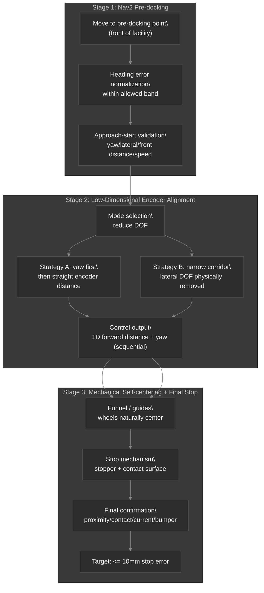
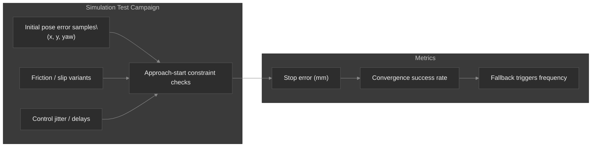

# The Curse of Dimensionality Problem

## Low-Dimensional Encoder-Guided Precision Docking for AMRs (10mm Stop)

This document expands on the core AMR RDS driving system described in `05_AMR_RDS.md` and focuses on one engineering problem that production systems repeatedly hit:

> “Perception-only docking works for one target, but breaks at fleet scale.”

The underlying reason is a *curse of dimensionality*: every additional independent variable (marker identity, pose, lighting, camera intrinsics/extrinsics, installation drift, equipment-specific tuning, maintenance state, etc.) increases the operating space faster than a practical system can cover with ad-hoc perception assets.

The goal here is to redesign docking into a **constrained, low-dimensional control problem**:

1. Use Nav2 only to reach a **pre-docking region**.
2. Reduce degrees of freedom (DOF) during alignment so encoder-based control becomes well-posed.
3. Rely on **mechanical self-centering geometry** to absorb residual error.
4. Use a minimal final confirmation signal (contact/proximity/current/bumper) to guarantee a **<= 10mm** stop.

---

## 1) Why marker-based docking does not scale (fleet + maintenance)

Marker-based solutions are often perceived as “more accurate” because they measure pose directly. However, the fleet problem is not just accuracy; it is **maintenance complexity growth**.

In practice, each docking site becomes an operational asset that must be kept correct:

- marker mounting position and orientation drift
- marker visibility conditions (lighting, occlusion, camera placement changes)
- camera calibration changes (mount vibrations, replacements)
- per-equipment perception tuning and asset management

Even if a marker pipeline can achieve tight alignment for a single setup, fleet scale creates an asset-management workload that grows with the number of installations:

- markers are not only “sensing targets”; they become “managed infrastructure”
- new equipment types imply new perception assets and new verification

This is not a perception failure; it is an **operations engineering** failure.

---

## 2) The philosophy: from “keep identifying the world” to “self-converge with constraints”

Instead of continuously identifying and matching the external world, we convert docking into an internal repeated control problem:

- **Encoder-based alignment** keeps the final approach grounded in robot internal measurements (odometry/encoders).
- **Constrained access structure** ensures initial conditions are inside the region where low-dimensional control converges.
- **Mechanical self-centering** reduces sensitivity to remaining uncertainties.

In short:

> Constrained docking beats unconstrained perception when you care about fleet-scale maintainability.

---

## 3) System architecture (engineering view)

### Recommendation: three-stage docking pipeline

**Stage 1: Nav2 pre-docking (reach, normalize, validate)**

Nav2 is responsible for moving the robot to a **pre-docking point** that is “safe to align”.

Crucially, Nav2 is **not** responsible for the final 10mm precision stop.

**Stage 2: Encoder alignment mode (reduce DOF)**

Once inside the constrained region, we intentionally disable simultaneous multi-DOF control.

We align by controlling only the most relevant freedom first (e.g., yaw), then approach with 1D distance control (or a narrowed physical corridor).

**Stage 3: Mechanical self-centering + final confirmation**

Even if encoder alignment has residual error, the geometry guides wheels into the centerline.

Finally, we stop within 10mm using encoder distance + confirmation (contact/proximity/current/bumper).

---

### Mermaid diagram: constrained docking stack

---

## 4) Two encoder alignment strategies (choose based on facility geometry)

### Strategy A: sequential yaw then straight approach

Control order matters because encoder-based precision is reliable when the motion is predictable.

1. **Yaw alignment first**
   - rotate-in-place until yaw error is inside a tight bound
2. **Straight encoder distance**
   - drive forward using encoder distance control
   - limit lateral motion by stopping yaw corrections during the final distance segment

When you do not do simultaneous 3-DOF control, the control problem becomes low-dimensional and stable.

### Strategy B: narrow corridor / physical lateral DOF removal

Instead of forcing the robot to actively control lateral motion with encoders alone, shape the access path:

- install symmetric guides (or a funnel entrance)
- ensure the wheel contact constraints naturally suppress lateral DOF
- keep encoder control focused on forward distance (and maybe yaw at start)

This is not “sensor improvement”; it is **geometric algorithm design**.

---

## 5) Why 10mm precision is feasible (and what must be constrained)

Encoder-based precision docking works only under two core assumptions:

1. **Initial error is small enough**
2. **Motion prediction is sufficiently accurate**

Therefore, “low-dimensional final approach” requires **strong approach-start constraints**.

### Required constraints (engineering contract)

Before entering encoder alignment mode, verify:

- yaw error within a configured band (e.g., |yaw| <= theta_max)
- lateral offset within a configured band (or corridor geometry guarantees it)
- pre-docking front distance within [d_min, d_max]
- speed stability (approach speed limited; decel profile known)

If constraints fail:

- reject the entry
- re-run Nav2 to a normalized pre-docking pose
- or adjust with a safe fallback behavior

This contract is the practical meaning of constrained docking.

---

## 6) Encoder limitations and the necessary “last-mile” signals

Encoders alone cannot eliminate absolute global reference error. They are strong in *relative motion*, not absolute world anchoring.

To achieve industrial robustness, use encoders for most of the approach, and add a final correction / confirmation:

- proximity switch or bumper near the stop surface
- simple front planar contact sensor
- motor current / torque threshold (slip or contact)
- wheel stall / decel pattern detection

Think of it as:

> Encoders are the “eyes” for controlled approach; the final signal is the “touch” for guarantee.

Also account for:

- wheel slip from friction changes
- backlash or compliance in the mechanical interface
- load-dependent effects

So the architecture must include **mechanical convergence** (self-centering geometry) and **speed limits**.

---

## 7) Fleet-scale scalability: parameter tables beat marker fleets

With encoder + constrained geometry, equipment differences can be handled by parameters rather than perception assets.

Instead of “marker 100 units”, the system becomes:

- “parameter table 100 units”

Example equipment classes:

| Equipment Type | Interface Params (examples) |
|---|---|
| Type A: front-facing docking | target stop distance, decel profile, yaw threshold |
| Type B: left-guide docking | entry yaw band, lateral guide widths, forward distance control |
| Type C: narrow passage docking | corridor geometry constraints, DOF reduction mode, speed cap |

Operational differences become **configuration** (repeatable engineering), not **maintained perception assets** (operational overhead).

---

## 8) Isaac Sim validation strategy (make it statistically verifiable)

Encoder-guided docking is a great fit for simulation because you can systematically vary:

- initial pose error distribution
- friction / slip model
- deceleration delays / control period jitter
- contact or proximity sensor noise
- wheelbase compliance / backlash

Use Monte Carlo testing to ensure:

- the system enters encoder alignment mode only under safe start conditions
- convergence succeeds within <= 10mm for the expected distribution

This compresses real-world maintenance risk into a simulation-verifiable statistical problem.

---

## 9) Implementation keywords (how to name your system internally)

This document frames the solution under reusable system engineering terms:

- Constrained docking
- Pre-docking pose normalization
- Low-dimensional final approach
- Geometry-assisted alignment
- Self-centering structure
- Parameter-class-based equipment interface

---

## 10) One-sentence definition (your design in one line)

This docking approach is:

> **Constrained alignment that converges using robot internal motion constraints and facility geometry, instead of continuously matching external perception markers.**

---

## 11) Practical checklist (operators/engineers)

1. Define pre-docking region and Nav2 goal rules (reach + heading band).
2. Define approach-start validation thresholds (yaw, distance, speed).
3. Implement encoder alignment mode with DOF reduction (yaw-first or corridor mode).
4. Build or verify self-centering geometry (funnel, guides, stopper).
5. Add final confirmation (contact/proximity/current) to guarantee the <= 10mm stop.
6. Verify with Isaac Sim Monte Carlo: success rate vs error distribution.

