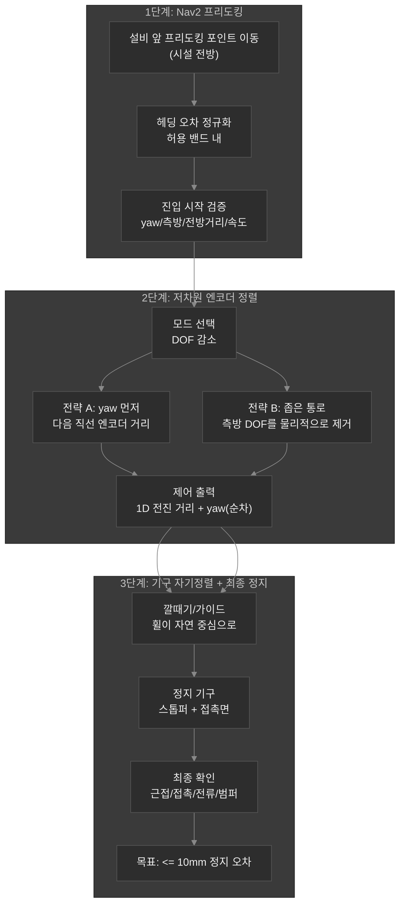
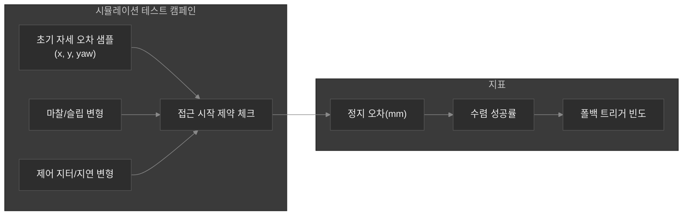

 # 차원의 저주 문제

## AMR을 위한 저차원 엔코더 유도 정밀 도킹(10mm 정지)

이 문서는 `05_AMR_RDS.md`에 정리된 AMR RDS 구동(기본 주행·도킹·Nav2 스택)의 핵심을 확장한다. 생산 현장에서 반복해서 마주치는 한 가지 엔지니어링 문제에 집중한다.

> “인지만으로 도킹하면 한 대는 맞지만, 플릿(여러 대) 규모에서 깨진다.”

그 근본 원인은 **차원의 저주(curse of dimensionality)** 다. 독립 변수가 하나씩 늘어날수록(마커 ID/포즈, 조명, 카메라 내·외부 파라미터, 설치 드리프트, 장비별 튜닝, 정비 상태 등) 시스템이 커버해야 하는 동작 공간이 현실적인 한계보다 더 빠르게 증가한다. 결국 임시방편 수준의 인지 자산으로는 감당이 어렵다.

여기서 도킹을 **제약된, 저차원 제어 문제**로 재설계하는 것이 목표다.

1. Nav2는 **프리도킹 구간(접근 가능한 구간)** 까지만 담당한다.
2. 정렬 단계에서 자유도(DOF)를 줄여 엔코더 기반 제어가 “잘-정의(well-posed)” 되게 만든다.
3. **기구적 자기정렬성(mechanical self-centering geometry)** 으로 잔여 오차를 흡수한다.
4. 마지막은 최소한의 확인 신호(접촉/근접/전류/범퍼)로 **<= 10mm** 정지를 보장한다.

---

## 1) 마커 기반 도킹이 스케일업에서 실패하는 이유(플릿 + 유지보수)

마커 기반 해법은 포즈를 직접 측정하므로 “더 정확해 보인다”. 하지만 플릿 문제는 정확도만의 문제가 아니다. **유지보수 복잡도**가 빠르게 증가한다.

현장에서는 각 도킹 지점이 “운영 자산”이 되며, 다음이 계속 관리되어야 한다.

- 마커의 장착 위치/방향 드리프트
- 마커 가시성 조건(조명, 가림, 카메라 위치 변화)
- 카메라 캘리브레이션 변화(마운트 진동, 교체)
- 장비별 인지 튜닝 및 자산 관리

특정 설치 환경에서 마커 파이프라인이 한 번 잘 맞아도, 플릿 규모에서는 설치 개수에 따라 자산관리 업무가 커진다.

- 마커는 단순 “센싱 대상”이 아니라 “관리되는 인프라”가 된다.
- 장비 유형이 늘면 새로운 인지 자산/검증이 필요해진다.

이는 단순 인지 실패가 아니라 **운영 엔지니어링(operations engineering) 실패**로 보는 게 맞다.

---

## 2) 철학: “세상을 계속 식별”에서 “제약으로 자기 수렴”으로

외부 세계를 지속적으로 식별·매칭하는 대신, 도킹을 **내부 반복 제어 문제**로 바꾼다.

- **엔코더 기반 정렬**은 최종 접근을 로봇 내부 측정(오도메트리/엔코더)에 기반한다.
- **제약된 접근 구조(constrained access structure)** 는 초기 조건이 저차원 제어 수렴 영역 안에 들어오도록 보장한다.
- **기구적 자기정렬성**은 남은 불확실성에 대한 민감도를 낮춘다.

한 줄로 요약하면:

> 플릿 규모 유지보수 가능성을 원하면, 제약 기반 도킹이 비제약 인지보다 이긴다.

---

## 3) 시스템 아키텍처(엔지니어링 관점)

### 권장: 3단계 도킹 파이프라인

**1단계: Nav2 프리도킹(도달, 정규화, 검증)**

Nav2는 로봇을 “정렬하기 안전한” **프리도킹 포인트**로 이동시키는 일을 맡는다.
중요한 점은 Nav2가 **10mm 정밀 정지의 최종 역할을 담당하지 않는다**는 것이다.

**2단계: 엔코더 정렬 모드(자유도 축소)**

제약 구간에 들어가면 의도적으로 **동시 다중 DOF 제어**를 끈다.

정렬은 먼저 가장 중요한 자유도(예: yaw)만 제어하고, 이후에는 1D 거리 제어(또는 물리적으로 좁혀진 통로)를 통해 접근한다.

**3단계: 기구적 자기정렬 + 최종 확인**

엔코더 정렬에 잔여 오차가 남더라도, 기하/가이드는 휠을 자연스럽게 중심선으로 유도한다.

마지막은 엔코더 거리 + 확인(접촉/근접/전류/범퍼)으로 **10mm 이내**에서 멈춘다.

---

### Mermaid: 제약된 도킹 스택

---

## 4) 엔코더 정렬 전략 2가지(시설 기하학에 따라 선택)

### 전략 A: yaw(회전) 먼저 → 직선 접근

엔코더 기반 정밀도가 “움직임이 예측 가능할 때” 안정적으로 동작하므로 제어 순서가 중요하다.

1. **yaw 정렬부터**
   - 제자리 회전으로 yaw 오차를 타이트한 범위로 축소
2. **직선 엔코더 거리**
   - 엔코더 거리 제어로 전진
   - 마지막 거리 구간에서는 yaw 보정을 멈춰 측방 움직임을 억제

동시 3-DOF 제어를 하지 않으면, 제어 문제가 저차원으로 줄어들고 안정해진다.

### 전략 B: 좁은 통로 / 측방 DOF를 물리적으로 제거

엔코더만으로 로봇이 측방 운동까지 능동적으로 제어하도록 강제하지 말고, 접근 경로 자체를 설계로 해결한다.

- 대칭 가이드(또는 깔때기 형태) 설치
- 휠 접촉 제약이 자연스럽게 측방 DOF를 억제하도록 구성
- 엔코더 제어는 전진 거리(필요하면 시작 시 yaw) 중심으로 유지

이건 “센서 성능 개선”이 아니라 **기하학적 알고리즘 설계**다.

---

## 5) 10mm 정밀이 가능한 이유(그리고 반드시 제약해야 할 것)

엔코더 기반 10mm 정밀 도킹은 두 가지 전제가 성립해야만 한다.

1. **초기 오차가 충분히 작다**
2. **운동 예측이 충분히 정확하다**

따라서 “저차원 최종 접근”은 **접근 시작 조건을 강하게 제한**해야 한다.

### 필요한 제약(엔지니어링 계약)

엔코더 정렬 모드로 들어가기 전에 아래를 검증한다.

- yaw 오차가 설정된 밴드 내(|yaw| <= theta_max 같은 조건)
- 측방 오프셋이 설정된 밴드 내(또는 통로 기하학이 보장)
- 프리도킹 전방 거리가 [d_min, d_max] 내
- 속도 안정성(접근 속도 제한, 감속 프로파일이 알려져 있음)

조건이 깨지면:

- 진입을 거절
- Nav2로 정규화된 프리도킹 자세를 다시 만든 뒤 재시도
- 또는 안전한 폴백 행동으로 전환

이 계약이 곧 “제약 기반 도킹”의 실전 의미다.

---

## 6) 엔코더의 한계와 마지막 ‘마일’ 신호

엔코더만으로는 절대 기준에 대한 글로벌 기준 오차를 완전히 제거할 수 없다. 엔코더는 **상대 운동**에는 강하지만, **절대 월드 고정**에는 약하다.

산업 현장에서는 엔코더로 대부분의 접근을 하고, 마지막에 “최종 보정/확인”을 추가한다.

- 정지면 근처의 근접 스위치/범퍼
- 전면 평면 접촉 센서(단순형)
- 모터 전류/토크 임계치(슬립 또는 접촉 판정)
- 휠 스톨/감속 패턴 감지

비유하면:

> 엔코더는 제어 접근의 “눈”이고, 마지막 신호는 “확실한 손(터치)”이다.

또한 아래도 고려해야 한다.

- 마찰 변화로 인한 휠 슬립
- 기구 인터페이스의 백래시/컴플라이언스
- 하중 의존 효과

그래서 아키텍처에는 **기구적 수렴성(자기정렬 기하)** 과 **속도 제한**이 함께 들어가야 한다.

---

## 7) 플릿 스케일링: 마커 플릿 대신 파라미터 테이블

엔코더 + 제약된 기하학 조합이면, 장비 차이는 인지 자산이 아니라 파라미터로 흡수할 수 있다.

“마커 100개”가 아니라:

- “파라미터 테이블 100개”

예시 장비 클래스:

| 장비 유형 | 인터페이스 파라미터(예) |
|---|---|
| Type A: 정면 정렬형 | 목표 정지 거리, 감속 프로파일, yaw 임계치 |
| Type B: 좌측 기준면 정렬형 | 진입 yaw 밴드, 가이드 폭, 전진 거리 제어 |
| Type C: 좁은 통로 진입형 | 통로 기하 제약, DOF 감소 모드, 속도 상한 |

운용 차이는 **재현 가능한 구성(configuration)** 으로 바뀌고,
유지보수하는 인지 자산(운영 오버헤드)은 줄어든다.

---

## 8) Isaac Sim 검증 전략(통계적으로 검증 가능하게)

엔코더 유도 도킹은 시뮬레이션에 매우 잘 맞는다. 왜냐하면 아래를 체계적으로 바꿀 수 있기 때문이다.

- 초기 자세 오차 분포
- 마찰/슬립 모델
- 감속 지연/제어 주기 지터
- 접촉/근접 센서 노이즈
- 휠베이스 컴플라이언스/백래시

몬테카를로 테스트로 아래를 보장한다.

- 엔코더 정렬 모드는 안전한 시작 조건에서만 진입
- 기대 분포에서 수렴이 <= 10mm 안에서 성공

이렇게 하면 현실에서의 유지보수 리스크를 “시뮬에서 검증 가능한 통계 문제”로 압축한다.

---

## 9) 내부 명명 키워드(시스템 공용 언어)

이 문서는 아래처럼 재사용 가능한 시스템 엔지니어링 용어로 접근한다.

- 제약 기반 도킹(constrained docking)
- 프리도킹 포즈 정규화(pre-docking pose normalization)
- 저차원 최종 접근(low-dimensional final approach)
- 기하학 보조 정렬(geometry-assisted alignment)
- 자기정렬 구조(self-centering structure)
- 장비 클래스 기반 파라미터 인터페이스(parameter-class-based equipment interface)

---

## 10) 한 문장 정의(내 설계 한 줄)

이 도킹 접근은:

> **외부 인지 마커를 계속 매칭하는 대신, 로봇 내부 운동 제약과 설비 기하학으로 수렴하도록 만드는 제약 정렬이다.**

---

## 11) 실무 체크리스트(운영/엔지니어)

1. 프리도킹 구간과 Nav2 goal 규칙을 정의(도달 + 헤딩 밴드).
2. 접근 시작 검증 임계치 정의(yaw, 거리, 속도).
3. 엔코더 정렬 모드를 구현(DOF 감소: yaw-first 또는 corridor 모드).
4. 자기정렬 기하(깔때기, 가이드, 스톱퍼)를 구축하거나 검증.
5. 최종 확인(접촉/근접/전류 등)으로 <= 10mm 정지를 보장.
6. Isaac Sim 몬테카를로로 성공률 vs 오차 분포 검증.

---

## 12) 유사 철학적 문제 7가지

여기서 말하는 “차원의 저주/제약 기반 수렴” 철학은 도킹뿐 아니라 다른 산업 로보틱스의 병목에서도 반복된다. 라스트 마일 문제를 포함해, 비슷한 구조의 문제 7가지를 정리한다.

1. **라스트 마일(Last-mile) 문제**: 전체 파이프라인은 동작하지만, 마지막 정렬/접촉 구간에서 오차가 누적되어 실패하는 문제.
2. **센서 자산화(Sensor Assetization) 문제**: 인지 성능을 유지하기 위해 마커/캘리브레이션/라벨/검증 자산이 점점 늘고, 유지보수 비용이 운영 규모에 따라 폭발하는 문제.
3. **운영 공간 차원의 저주(Curse of Dimensionality) 문제**: 독립 변수(설치 상태, 조명, 프레임, 장비 유형 등)가 조금만 늘어도 “가능한 케이스 공간”이 급격히 커져 고정 규칙이 깨지는 문제.
4. **분포 이동(Distribution Shift) 문제**: 실험/시뮬/초기 운영의 분포가 현장 분포와 달라서 “늘 되던 것이 갑자기 안 되는” 문제.
5. **추정-제어 결합 오차 증폭 문제**: 추정(인지/로컬라이제이션) 오차가 제어 루프에서 비선형적으로 증폭되어, 작은 불확실성이 큰 실패로 이어지는 문제.
6. **시간가변 캘리브레이션(Time-varying Calibration) 문제**: 드리프트/마찰 변화/백래시 등으로 기준이 시간에 따라 변해, 고정 파라미터가 점점 어긋나는 문제.
7. **엣지케이스/검증 폭발(Verification Explosion) 문제**: 운영에서 필요한 예외 상황이 너무 많아 “검증 가능한 범위” 자체가 감당 불가능해지는 문제.

