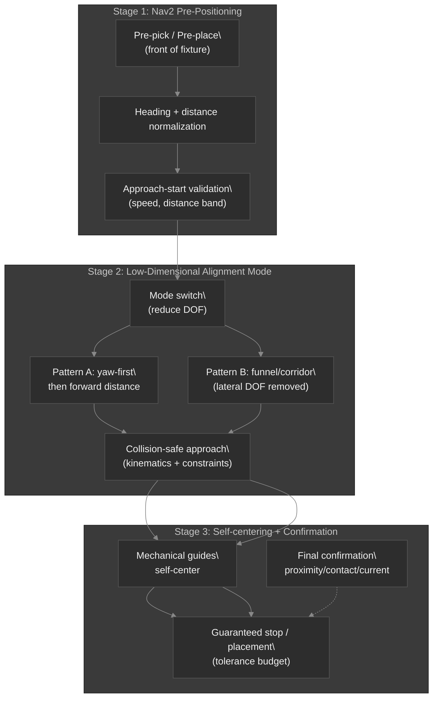

# The Curse of Dimensionality Problem (AMR + Robotic Arm Pick & Place)

## Constrained, Low-Dimensional Pick/Place for Multi-Joint Arms on AMRs (Fleet-Scale Robustness)

This document applies the same engineering philosophy used in `06_Curse_of_Dimensionality_Docking.md` to a different “last-mile” domain:

> “Perception-only pick-and-place can be tuned to work once, but breaks at fleet scale.”

The *curse of dimensionality* shows up even harder in manipulation because the system state contains more independent variables:

- AMR base pose error (translation + heading)
- arm joint configuration (redundancy, singularities, joint limits)
- object pose uncertainty (position, orientation, occlusion)
- grasp approach geometry (collision constraints, gripper kinematics)
- contact dynamics (friction, slip, compliance, backlash)
- environment changes (clutter, lighting, bin geometry drift)
- timing/latency (sensor delay + control loop jitter)

In marker-heavy solutions, the system “solves” missing state by adding more perception assets. That looks scalable in the lab, but becomes an operations problem in production.

So the goal is to redesign pick-and-place into a **constrained, low-dimensional control problem**:

1. Use the AMR navigation stack (Nav2) to reach a **pre-manipulation region**.
2. Reduce DOF during the final approach by switching to an **alignment mode** with sequential control (or physically constrained access).
3. Use **mechanical self-centering geometry** and a **final confirmation signal** (contact/proximity/current) to guarantee tight placement.
4. Compress fleet maintenance into **parameter tables per equipment class**, not per-site perception calibration.

---

## 1) Why perception-heavy pick/place does not scale (the fleet version)

The docking philosophy applies directly:

- Markers and visual targets become *managed infrastructure* (maintenance assets).
- Every new bin/fixture/installation adds a new perception/verification workload.
- Object pose uncertainty is not only “sensed”; it also changes contact outcomes.

At fleet scale, the real failure mode is not “accuracy”; it is **verification explosion**:

- different lighting -> different detection stability
- different object instances -> different grasp success
- small base drift -> changes the reachability region
- slight geometry offsets -> amplify contact errors

Result: you end up with per-site tuning and per-site debugging cycles.

---

## 2) One-step definition (your design in one line)

> **Constrained alignment + encoder-guided motion + geometry-assisted convergence, so the last-mile is guaranteed without continuously matching the external world.**

---

## 3) Recommended pipeline (three-stage pick/place)

### Stage 1: Nav2 pre-positioning (reach + normalize)

Nav2 does not “solve precision”. It only brings the AMR to a region where low-dimensional alignment is valid:

- move to the **pre-pick / pre-place point**
- normalize heading error within a band
- ensure front distance is inside a feasible range for the arm
- verify approach speed stability (avoid dynamic effects near the arm)

**Deliverable:** “AMR base is in an alignable pose class.”

### Stage 2: Low-dimensional alignment mode (reduce DOF)

Switch to a manipulation alignment mode where you intentionally avoid simultaneous 3-DOF (or higher) correction.

Two patterns:

#### Pattern A: sequential yaw → then linear insertion

1. Align yaw/orientation first (or approach direction).
2. Freeze the irrelevant freedom(s).
3. Perform the final approach using encoder/kinematics guided 1D distance control.

#### Pattern B: corridor / funnel access (physically remove lateral DOF)

If the facility offers guides:

- restrict the entry corridor with symmetric rails / funnels
- let the mechanical constraints suppress lateral motion
- the arm focuses on reaching the correct depth and collision-safe pose

This turns the hard perception problem into a geometry-constrained control problem.

### Stage 3: Mechanical self-centering + final confirmation

Even after encoder-guided alignment, residual errors remain. So the last signal must be cheap and decisive:

- proximity sensor near the target surface
- contact switch / bumper
- gripper force/current threshold (slip or contact)
- simple planar touch probe or end-effector feeler

**Deliverable:** stop/placement is guaranteed within tolerance (e.g., a “placement error budget”).

---

## 4) Mermaid: constrained pick/place stack on an AMR

---

## 5) DOF reduction design (engineering contract)

Low-dimensional final approach is valid only if the entry conditions are constrained.

Before enabling encoder/kinematics alignment mode, verify:

1. **Base pose class:** heading within a configured band, front distance within [d_min, d_max]
2. **Reachability:** arm can reach the approach pose without violating joint limits/singularity margins
3. **Collision safety:** predicted path respects keep-out zones and bin walls
4. **Speed stability:** motion period jitter limited; decel profile known

If any contract fails:

- reject entry into alignment mode
- re-run Nav2 to a normalized pre-manipulation pose
- or switch to a safe fallback strategy (slower approach, larger clearance, re-plan)

---

## 6) Fleet-scale interface: “parameter tables per equipment class”

In marker docking, the fleet multiplies maintenance assets.

In constrained pick/place, the fleet multiplies configuration parameters instead.

Represent each equipment site as a class (Type A/B/C):

| Equipment class | Key parameters (examples) |
|---|---|
| Type A: front-facing grasp station | pre-base offset, yaw band, approach depth, decel profile |
| Type B: side-guide pick/place | corridor width, lateral constraints, collision margins |
| Type C: narrow passage / funnel bin | funnel geometry, DOF reduction mode, stop budget |

The arm software remains mostly the same; you only update a compact parameter set.

---

## 7) Isaac Sim verification: compress maintenance risk statistically

This architecture is also easier to validate in Isaac Sim:

You can Monte Carlo test:

- initial base pose error (x, y, yaw)
- object pose distribution (position + rotation)
- friction/slip parameters
- control delay + jitter
- encoder noise
- contact compliance/backlash

Metrics that matter:

- success rate of pick
- placement error distribution (mm)
- slip/contact event classification frequency
- time-to-complete
- fallback trigger rate

Result: you can pre-compress “real maintenance chaos” into a simulation-verifiable statistical risk model.

---

## 8) Implementation keywords (system language)

Use these terms to align design, code, and ops:

- Constrained manipulation docking
- Pre-manipulation pose normalization
- Low-dimensional final approach
- Encoder-guided alignment mode
- Geometry-assisted self-centering
- Parameter-class-based equipment interface
- Final confirmation gating (contact/proximity/current)

---

## 9) Practical checklist (engineers/operators)

1. Define pre-pick/pre-place regions and Nav2 goal rules.
2. Implement approach-start validation thresholds (base heading band, distance band, speed stability).
3. Implement alignment mode:
   - DOF reduction policy (yaw-first or corridor)
   - collision-safe arm approach
4. Verify mechanical self-centering geometry (guides/funnel/stopper).
5. Add final confirmation gating (proximity/contact/current thresholds).
6. Validate with Isaac Sim Monte Carlo for success rate and placement error budget.

