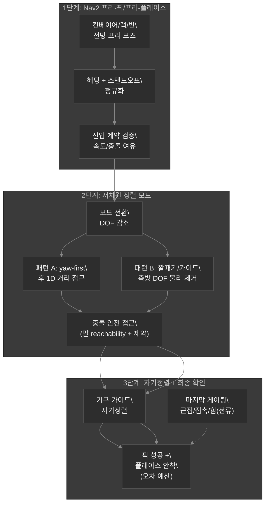
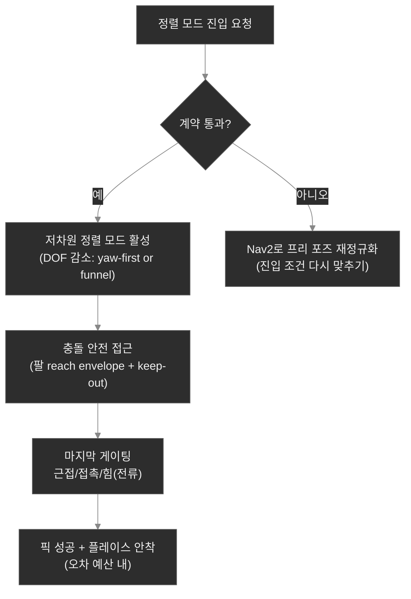
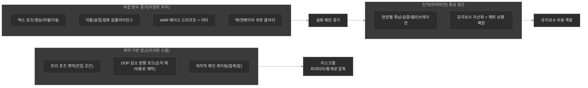
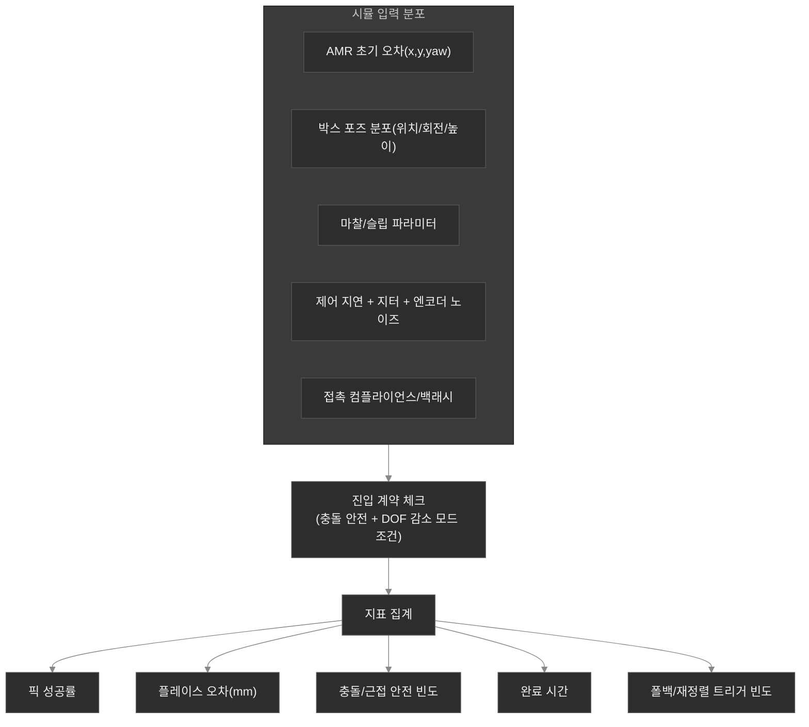

# 차원의 저주 문제 (AMR + 다관절 로봇팔 픽 & 플레이스)

## AMR 위 다관절 로봇팔을 위한 제약 기반 저차원 픽/플레이스(플릿-스케일 견고성)

이 문서는 물류센터에서 **AMR 위 다관절 로봇팔**이 박스를 **픽앤플레이스**하는 상황(랙/컨베이어/토트/팔레트/빈)에서 반복해서 터지는 마지막-마일 병목을 다룬다.

> “시뮬/실험에서는 한 박스를 잘 집을 수 있는데, 현장/플릿에서는 ‘조금씩’씩 안 맞아 결국 유지보수가 폭발한다.”

물류 조작은 차원의 저주가 더 강하게 나타난다. 왜냐하면 시스템 상태의 독립 변수가 많아질 뿐 아니라, 작은 오차가 충돌·슬립·삽입 실패로 **비선형적으로 증폭**되기 때문이다.

- AMR 베이스 포즈 오차(이동 + 헤딩) → 팔 접근 가능 영역/충돌 여유가 즉시 변함
- 로봇팔 관절 구성(중복 자유도, 특이점, 관절 한계) → 같은 목표라도 접근 경로가 달라짐
- 박스 포즈 불확실성(회전, 높이, 포장 상태, 라벨/모서리 가림) → 집기/받침 접촉이 달라짐
- 접근 기하 제약(랙/가이드/컨베이어 벽, 그리퍼/손가락 충돌) → “가능한” 경로 자체가 줄어듦
- 접촉 동역학(마찰, 슬립, 컴플라이언스, 백래시) → 잡기 성공이 물체·표면에 의존
- 물류 환경 변화(클러터, 조명, 빈/수납 구조 드리프트, 컨베이어 진동) → 타깃이 아니라 “운영 조건”이 바뀜
- 시간/지연(센서 딜레이 + 제어 루프 지터) → 접촉 전 정렬 타이밍이 흔들림

마커/타깃 기반 인지 해법은 빠진 상태를 더 많은 인지 자산으로 메우도록 만든다. 실험실에서는 맞춰 보이지만, 플릿 규모에서는 “각 설치마다” 유지보수와 검증이 쌓인다.

그래서 목표는 픽앤플레이스를 **제약된, 저차원 제어 문제**로 재설계하는 것이다.

1. AMR 내비게이션(Nav2)으로 **프리-픽/프리-플레이스 구간**(팔이 안전하게 접근 가능한 구간)으로 이동
2. 최종 접근 단계에서 **정렬 모드(alignment mode)** 로 전환해 DOF를 줄이고, 순차 제어(yaw-first) 또는 물리적으로 좁혀진 접근(깔때기/가이드)으로 박스/입구에 수렴
3. **기구적 자기정렬성(mechanical self-centering geometry)** 과 **마지막 확인 신호**(근접/접촉/그리퍼 힘/전류)로 슬립·삽입 실패를 차단하고 배치 정밀성을 보장
4. 플릿 유지보수는 “현장마다 인지 캘리브레이션”이 아니라 **설비 클래스별 파라미터 테이블**(접근 깊이, 속도/감속, 허용 오차, DOF 감소 모드)로 압축

---

## 1) 인지 비중이 큰 박스 픽/플레이스가 스케일업에서 실패하는 이유(플릿 버전)

도킹의 “마커는 관리되는 인프라가 된다”가, 픽앤플레이스에서는 더 노골적으로 드러난다.

물류센터에서는 마커/시각 타깃이 다음처럼 바뀐다.

- 박스 자체가 아니라 **픽 스테이션/빈 입구/랙 기준면**이 “관리 자산”이 됨
- 장비/랙 배치 변경, 조명 변화, 컨베이어 진동 변화가 누적되면서 **설치마다 보정·검증**이 필요해짐
- 박스 인스턴스가 달라지면(재질/무게/모서리 형상) 접촉이 달라져 “인지가 맞아도” 성공이 갈라짐

플릿 규모에서 진짜 실패 모드는 “포즈가 덜 정확함”보다 **운영 검증 폭발**이다.

- 조명이 다르면 검출 안정성이 달라짐(라벨/반사/그림자)
- 박스 크기/포장이 다르면 그리퍼의 접촉점과 슬립 조건이 달라짐
- AMR 베이스가 조금만 달라져도 팔이 같은 접근 경로를 못 쓰거나(충돌 제약) 속도가 바뀜
- 컨베이어/랙 주변 클러터가 늘면 “가능한 접근” 자체가 줄어 실패 패턴이 증가

그래서 현장별 튜닝과 디버깅 루프가 쌓인다. 이건 센서가 약해서가 아니라, 문제를 **저차원 제어로 바꾸지 못했기 때문**이다.

---

## 2) 한 문장 정의(당신의 설계 한 줄)

> **제약 기반 정렬 + 엔코더 유도 모션 + 기하학 보조 수렴**으로, 외부 세계를 지속적으로 매칭하지 않아도 마지막 구간을 보장한다.

---

## 3) 추천 파이프라인(3단계 박스 픽/플레이스)

여기서 핵심은 “Nav2가 정밀 정지를 하는가”가 아니라, **팔이 다룰 수 있는 저차원 문제로 마지막을 좁히는가**다.

### 1단계: Nav2 프리-픽/프리-플레이스(도달 + 정규화)

Nav2는 박스에 대한 정밀 정렬을 책임지지 않는다. Nav2의 책임은 AMR을 **팔이 접근 가능한 ‘정렬 가능한 구간(alignable pose class)’** 으로 보내는 것이다.

- 컨베이어 픽이면: 로봇팔이 박스 접근면에 접근 가능한 **프리-픽 포즈**로 이동
- 랙/가이드 픽이면: 충돌 여유가 확보되는 **프리-픽 포즈**로 이동(팔의 keep-out zone 반영)
- 빈/토트/팔레트 플레이스면: 그리퍼가 입구를 “잘 물 수 있는” **프리-플레이스 포즈**로 이동
- 헤딩/스탠드오프를 밴드 내에서 정규화(접근 시작 조건 계약)
- 접근 속도/감속이 팔 근접 구간에서 흔들리지 않도록 제한

**산출물:** AMR 베이스 포즈 클래스가 “저차원 정렬 모드로 진입 가능한 조건”을 만족한다.

### 2단계: 저차원 정렬 모드(자유도 감소)

정렬 모드에서는 의도적으로 자유도를 줄인다. 물류 문제에서 특히 중요한 건 **3-DOF 동시 보정**이 아니라, “관측/제어가 안정된 1~2자유도만 먼저 맞추는 것”이다.

패턴 2가지:

#### 패턴 A: yaw-first → 직선 접근(그리퍼 접근 방향 수렴)로 마감

1. 접근 방향(대개 yaw)을 먼저 정렬
2. 나머지 자유도(측방/대각)는 동결(또는 제약으로 약화)
3. 엔코더/기구학 유도 1D 거리 제어로 그리퍼/팔을 목표면에 접근

픽에서는 그리퍼가 박스의 “집기면”으로, 플레이스에서는 입구/플레이트로 1차 수렴시키는 게 목표다.

#### 패턴 B: 통로/깔때기 접근(funnel)으로 측방 DOF를 물리적으로 제거

물류센터 설비는 종종 가이드/레일/깔때기 형태를 제공한다.

- 대칭 가이드 또는 깔때기로 진입 통로를 제한
- 기구 제약이 측방 운동을 자연스럽게 억제
- 팔은 깊이(전진 거리)와 충돌 안전 포즈에 집중

이렇게 하면 “정확한 외부 인지”가 아니라 **기하학적 수렴 구조**가 실패 확률을 깎아준다.

### 3단계: 기구 자기정렬 + 마지막 확인(접촉/힘 게이팅)

엔코더 유도만으로는 남는 잔여 오차가 있다. 그래서 마지막은 싸고 확실한 확인 신호로 잠근다.

- 근접 센서(입구/목표면 근처)
- 접촉 스위치/범퍼(박스 가장자리 또는 입구 림(rim))
- 그리퍼 힘/전류 임계치(슬립/접촉 판정)
- 엔드이펙터의 단순 접촉 프로브(가능하면 평면 기준)

**산출물:** 픽/플레이스의 허용 오차 예산 안에서
1) 집기(슬립 방지)와
2) 삽입/안착(충돌 방지)을 동시에 보장한다.

---

## 4) Mermaid: AMR 위 제약 기반 픽/플레이스 스택

### 4.1 Mermaid: 저차원 정렬 모드 진입 “계약” 게이팅

### 4.2 Mermaid: 플릿 규모의 “검증 폭발” vs 제약 기반 “리스크 압축”

---

## 5) DOF 감소 설계(엔지니어링 계약)

저차원 최종 접근은 **진입 조건이 강하게 제한**될 때만 성립한다. 물류센터에서는 특히 “충돌 여유”와 “박스 집기면 접근성”이 계약의 핵심이다.

정렬 모드를 켜기 전에 아래를 검증한다.

1. **베이스 포즈 클래스:** 헤딩 밴드 내 + 설비별 스탠드오프 [d_min, d_max] 내
2. **도달성(Reachability):** 관절 한계/특이점 여유를 넘기지 않고, 그리퍼 접근 포즈를 팔이 도달 가능해야 함
3. **충돌 안전성:** 랙/가이드/컨베이어 벽의 keep-out zone을 침범하지 않는 접근 경로여야 함(팔 reach envelope 포함)
4. **박스 타입 계약:** 박스 크기/무게 클래스에 맞춰 접근 깊이와 그리퍼 힘 임계치를 선택(슬립 조건 포함)
5. **속도 안정성:** 센서-제어 지연과 모션 주기 지터가 제한되고, 감속 프로파일이 알려져 있어야 함

계약이 실패하면:

- 정렬 모드 진입을 거절(“정밀 접근”을 아예 건너뛴다)
- Nav2로 다시 정규화된 프리 포즈로 이동
- 또는 안전 폴백(느린 접근, 더 큰 여유, 재계획)으로 전환

---

## 6) 플릿 스케일 인터페이스: “설비 클래스별 파라미터 테이블”

물류에서 장비/박스/환경이 늘수록 마커 자산화는 유지보수를 폭발시킨다. 제약 기반 픽/플레이스는 대신 **설비 클래스별 파라미터 테이블**로 관리한다.

각 현장을 클래스(Type A/B/C)로 묶고, 로봇팔 제어는 대부분 동일한 코드를 사용한다. 바뀌는 것은 파라미터뿐이다.

| 설비 클래스 | 핵심 파라미터(예) |
|---|---|
| Type A: 컨베이어 정면 픽(상단/측면) | 박스 목표면 기준 접근 방향, 프리-베이스 오프셋, yaw 밴드, 접근 깊이, 감속 프로파일, 집기 힘 임계치 |
| Type B: 랙 측면 픽/플레이스(가이드 통로) | 통로 폭/가이드 폭, 측방 제약, 팔 접근 안전 포즈, 충돌 여유, yaw-first 정책 |
| Type C: 토트/팔레트 삽입형 플레이스(깔때기/안내면) | 깔때기 기하, 삽입 깊이, DOF 감소 모드, 최종 확인 게이팅 거리(근접/접촉) 및 오차 예산 |

---

## 7) Isaac Sim 검증: 유지보수 리스크를 물류 통계로 압축

물류 박스 픽/플레이스는 “맞추기”보다 “실패 확률이 얼마나 줄었는가”가 핵심이다. 제약 기반 접근은 Isaac Sim에서 몬테카를로로 검증하기 좋다.

변형(시나리오 분포)을 아래처럼 둔다.

- AMR 초기 베이스 포즈 오차(x, y, yaw)
- 박스 포즈 분포(위치, 회전, 높이, 라벨/가림에 따른 인지 전처리 영향)
- 박스 마찰/슬립 파라미터(재질/포장에 따른 변화)
- 컨베이어/랙 주변 진동(있다면), 클러터 증가
- 제어 지연 + 지터(센서 딜레이 포함)
- 엔코더/관절 노이즈
- 접촉 컴플라이언스/백래시

중요 지표:

- 픽 성공률(슬립/미접촉 이벤트 포함 분류)
- 플레이스 안착 오차 분포(mm) (입구 림/기구 간섭 기준 포함)
- 충돌/근접 안전 이벤트 빈도
- 완료 시간(time-to-complete)
- 폴백/재정렬 트리거 빈도

결과적으로 “현장 유지보수 혼돈”을 시뮬레이션에서 **통계적으로 압축 가능한 리스크 모델**로 바꿀 수 있다.

### 7.1 Mermaid: Isaac Sim 몬테카를로 캠페인(입력 분포 → 지표)

---

## 8) 구현 키워드(시스템 공용 언어)

설계/코드/운영을 맞추기 위해 이 용어를 공유한다.

- 제약 기반 조작 도킹(constrained manipulation docking)
- 프리-매니퓰레이션 포즈 정규화(pre-manipulation pose normalization)
- 저차원 최종 접근(low-dimensional final approach)
- 엔코더 유도 정렬 모드(encoder-guided alignment mode)
- 기하학 보조 자기정렬(geometry-assisted self-centering)
- 장비 클래스 기반 파라미터 인터페이스(parameter-class-based equipment interface)
- 최종 확인 게이팅(final confirmation gating: 접촉/근접/전류)

---

## 9) 실무 체크리스트(엔지니어/운영)

1. 프리 픽/프리 플레이스 구간과 Nav2 goal 규칙을 정의한다.
2. 접근 시작 검증 임계치 정의(베이스 헤딩 밴드, 거리 밴드, 속도 안정성).
3. 정렬 모드 구현:
   - DOF 감소 정책(yaw-first 또는 corridor)
   - 충돌 안전 로봇팔 접근
4. 기구 자기정렬 기하를 검증한다(guides/funnel/stopper).
5. 최종 확인 게이팅(근접/접촉/전류 임계치)을 추가한다.
6. Isaac Sim 몬테카를로로 성공률과 배치 오차 예산을 검증한다.

